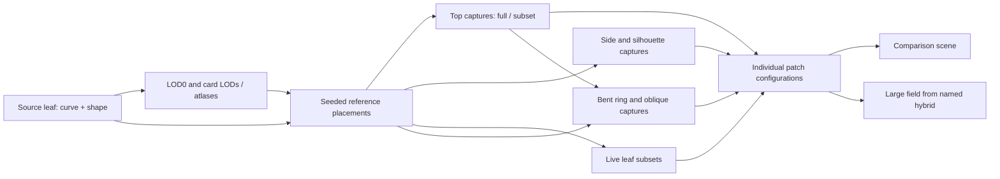

# Grass Debug v2

## Scope

Grass Debug v2 is the isolated scene for developing and comparing 3D grass. It
provides a dirt surface, asphalt road, game trees and city bus, camera navigation,
performance diagnostics, three ground substrates and a fixed grass LOD comparison.
It does not instantiate the v1 grass system or integrate grass into gameplay.
There are no additional setup, quality or lighting configuration panels or saved
scene settings.

Benchmark conclusions, their limits and the proposed direction for preserving
blade tips are recorded in [Grass LOD3 findings](GRASS_LOD3_FINDINGS.md).

## Versioned entry points

- `debug_tools/grass_debug_v2.html`: current screen, reached through Setup → Debugs →
  Grass Debug v2 (`G`). The unversioned `grass_debug.html` redirects here.
- `debug_tools/grass_debug_v1.html`: preserved historical lab, including its controls,
  asset families and `window.__grassLab` API. It remains available at its direct URL.
- `grass_lod_debug.html`, the historical capture runner and the historical browser
  validation suite explicitly target v1. Historical material/LOD “V2” terminology
  within that lab does not refer to the new screen version.


## Leaf asset pipeline

The random comparison study at
`debug_tools/grass_plant_study.html?layout=random` is generated by
`GrassDebugV2StudyPipeline.js`. It accepts one leaf definition and cross-section
shape, then creates every descendant through a dependency graph. The canonical
defaults remain `GRASS_V2_SINGLE_LEAF` and `GRASS_V2_DETAILED_BLADE`; changing
them and reloading the study regenerates the entire comparison.



### Recipe catalog and dependencies

`GrassDebugV2PipelineConfig.js` contains the configuration catalog, source count
and seed, capture LOD/resolution, texture sampling recipes and patch positions.
Each configuration has its own `configuration/<id>` graph item:

| ID | Generated configuration |
| --- | --- |
| `source` | Full live reference |
| `reference` | Every second source leaf |
| `texture4k` | Full top capture, walls and alpha fringe |
| `texture2k` | Subset top capture, walls and alpha fringe |
| `hybrid1k` | Full capture plus every fourth source leaf |
| `hybrid2k` | Subset capture plus alternating source leaves |
| `rings4k` | One oblique + top at 1024², cropped block and bent outer ring |

Names identify the current experiments; counts in labels, tooltips and snapshots
are calculated from the actual generated instances. Subsets use deterministic
stride/offset recipes, and textures are keyed by recipe ID rather than leaf
count. Two recipes with equal counts can therefore retain different placements.
Standard volume patches share the full reference's side captures, as in the
original comparison. Each experimental ring and its oblique views use the same
selected leaf subset as that experiment's top texture.

Volume, ring, directional-capture and large-field builders export their default
recipe objects. The catalog's `volume`, `ring`, `directional` and `field`
sections can override them; resolved parameters appear in the graph manifest.
The field's `sourceConfigurationId` names the hybrid whose texture, instance
transforms and LOD geometry it borrows.

Random leaf profiles now inherit the supplied leaf curve, width, cross-section
and azimuth. Profile bending scales with the source bounds. Atlas cameras,
capture bounds, canopy heights and ring heights are derived from the resulting
geometry. Physical layout choices such as the one-metre footprint, crop width
and ring strip depth remain explicit recipe parameters.

### Generation and ownership

`createGrassDebugV2StudyPipeline({renderer, material, ground, rootSoil,
shadowDirection, leaf, config})` returns the leaf, cards, reference patch,
comparison, field and pipeline. Injected materials and ground remain owned by
the caller. `leaf` accepts partial `definition` and `shape` overrides.

The debug study also exposes `window.__plantCardsStudy.generateAssets(options)`
for building a separate asset bundle, for example:

```js
const assets = await window.__plantCardsStudy.generateAssets({
    leaf: {
        definition: { curve: editedCurve },
        shape: { widthMeters: editedWidth }
    },
    config: { ring: { leafFraction: 0.4 } }
});
// Use assets.comparison.group / assets.patch / assets.largeField as needed.
assets.dispose();
```

Generation creates a fresh graph; it does not reuse a stale atlas or an earlier
leaf's variants, and does not replace the visible scene automatically.
`pipeline.getSnapshot()` records each item's dependencies, resolved parameters
and build status, with a source key for the leaf definition. Independent callers
can inspect generated items with `pipeline.get(id)`.

`GrassDebugV2AssetPipeline.js` validates dependencies before building, serializes
renderer work, generates shared nodes once and releases completed resources in
reverse dependency order. Bundle disposal is idempotent. Subsets and fields
release their instance buffers without disposing borrowed geometry or materials.
Generators remain responsible for cleaning temporary allocations if they fail
before returning an owned output.

This is the study's runtime asset-generation graph. Offline baking and asset
publication continue to use `node tools/bake.mjs` and the existing registered
domain/leaf hierarchy, validation and publication gates.

Validation:
- `grass_asset_pipeline.test.js`: dependency ordering, reuse, immutable manifest,
  invalid graphs, failure cleanup and disposal.
- `grass_pipeline_config.test.js`: recipe resolution and input validation.
- `grass_debug_v2_leaf_recipe.pwtest.js`: supplied curve/width propagation through
  every card LOD and atlas, deterministic placement and captures above one metre.
- `grass_debug_v2_pipeline.pwtest.js`: rebuild the full graph from a taller, wider
  leaf; compare geometry and actual capture pixels, derived heights and field
  sharing; verify disposal leaves the original bundle intact.
- Existing comparison, ring, directional-canopy and large-field regressions
  retain coverage of the default scene.

## Fixed baseline

- Plane dimensions derive from `BIG_CITY_SPEC_SOURCE`: 25 × 25 tiles at 24 metres,
  currently 600 × 600 metres, centered at the Big City map centre.
- Land defaults to the game's brown `pbr.gravelly_sand` catalog material (Gravelly
  Sand), with a four-metre repeat. Forest Soil selects `pbr.forest_ground_06`, the
  Planter reference substrate, with a local 2.5 m repeat. The shared catalog uses
  Poly Haven's 2.1 m physical width; Grass Debug explicitly overrides that scale.
  Brown Earth selects `pbr.brown_mud`, a finer bare-soil surface with small clumps,
  using Poly Haven's official 4K maps at the catalog's 1.3 m physical width.
  Its Grass Debug material has a damp-earth appearance: linear RGB albedo
  multipliers `(0.32, 0.29, 0.26)` and a 0.78 roughness multiplier retain the
  scanned texture variation with darker diffuse color and restrained sheen.
  These scene-local settings also reach both leaf studies through the shared land
  factory; source textures, global catalog calibration and game lighting are unchanged.
  All substrates resolve through the global PBR pipeline, using catalog defaults
  plus the local settings above, without calibration overrides. They use colour,
  OpenGL normal and packed AO/roughness/metalness
  maps, and up to 8× anisotropy. Forest Ground 06 uses official 2K Poly Haven maps
  stored in `assets/public/pbr/forest_ground_06/`, registered in the game catalog.
  No embedded Planter images or runtime dependency on its HTML are used.
  The plane renders both faces with the same textures and correctly flipped
  back-face normals, so views from below do not see through the ground.
- One two-way road runs through the field using `createRoadEngineRoads`, game road
  materials, asphalt defaults, lane markings, curbs and sidewalks.
- One full city bus uses `createBus` and the game bus catalog. It is grounded on the
  asphalt after the model finishes loading. Twelve fixed trees use the desktop
  game templates at varied positions, headings and heights.
- The renderer follows the display pixel ratio, capped at 2 like Planter, and
  refreshes it on viewport resize, including layout changes when the stats rows
  appear. The scene and postprocessing targets use the
  same drawing-buffer resolution, with MSAA and a cached static shadow map.
  Benchmarks record the actual buffer dimensions and pixel ratio for comparison.
  Sun direction, linear color, intensity, display exposure,
  tone mapping, hemisphere and HDR environment use the game's lighting and
  atmosphere resolvers, including saved game overrides and supported URL options.
  Without overrides, this is the calibrated afternoon sun at azimuth 45° and
  elevation 55°. The shared sky, SunBloomRig, SunRaysRig, SunFlareRig and sun bloom
  pipeline provide the game's visible sun and effects using its resolved settings.
  Lighting is resolved on page load; no lighting configuration controls are added.
- The initial camera uses the game's 55° FOV and `GameplayState.computeChaseParams`
  sizing rule: distance = max(8.5, longest bus bound × 1.35), height = max(3.2,
  longest bound × 0.55), look height = max(1.1, bus height × 0.32). Far clip is
  extended to 1600 m to inspect the whole terrain. The bus is stationary.
- Shared tool camera navigation provides orbit, pan and zoom. `1` restores the
  bus view; `2` selects Overview at XYZ `(19, 22, -22)` and yaw/pitch/roll
  `(138°, -38°, 0°)` using the stats row's YXZ convention. The orbit target is
  where this view direction meets the ground. Escape returns to the game.
- `W`/`S` move forward/backward along the view direction, `A`/`D` strafe left/right,
  and `Q`/`E` move down/up in world space. Movement translates the camera and its
  orbit target together at 8 m/s (24 m/s while holding Shift), preserving the view
  direction and the Y = 0.01 floor. Releasing keys or losing focus stops movement;
  text fields and browser shortcuts do not trigger camera movement.
- The camera can descend to world Y = 0.01 m during orbit, pan and zoom. V2 opts
  into the shared tool camera's `minHeight` floor; other screens keep their existing
  unconstrained height. Minimum orbit distance is 0.01 m. The near clipping plane
  shrinks with camera height, from 0.1 m normally to 0.005 m at the ground limit.
- A left control panel sits below the stats rows. Its Camera section contains the
  Bus camera, Overview, Grass comparison and Copy buttons. Grass comparison frames
  the four-block line experiment from above at an oblique angle and works independently
  of the selected grass mode.
  Copy writes the current camera pose to the clipboard as space-separated
  `X Y Z yaw pitch roll`, with angles in degrees using YXZ and values rounded to
  three decimal places. The button briefly confirms success or reports failure.
  The scene viewport uses the remaining width. The panel scrolls independently
  and provides space for future control sections, with no screen title, terrain
  summary or camera movement help.
- The Land section follows Grass, with side-by-side Gravelly Sand, Forest Soil
  and Brown Earth buttons and a visible selected state. Hover identifies Forest
  Ground 06 as the Planter substrate and Brown Mud as the fine bare earth.
  All three materials and their textures preload and compile before
  readiness; switching reuses the same terrain mesh. Inactive textures/materials
  are released with the scene. Planter's separate near-camera detail layer and
  ground-shadow shader are not included in this substrate selection.
- The shared top performance bar shows frame time/FPS, GPU time when supported,
  calls, triangles, memory and renderer identity. Its second row shows frame index
  and camera/bus world position and rotation.
- `Loading...` appears at the bottom center of the scene viewport from initial
  HTML load until readiness completes. It also clears if startup fails.
- Required asset failures remain visible as a startup error; readiness waits for
  models and textures. `window.__grassDebugV2` exposes `readiness`, `getSnapshot()`
  `setCamera('bus' | 'overview' | 'grass')`, `setGrassMode('OFF' | 'LOD0' | 'LOD3' | 'MIXED')`,
  `setLandSurface('gravelly_sand' | 'forest_ground_06' | 'brown_mud')`,
  `setMixedCardBounds(boolean)`,
  `startBenchmark()` and `cancelBenchmark()` for
  subsequent measurement work. Snapshots include the current benchmark state/result
  camera direction and the selected land material/scale.
- The HTML import map versions the scene module's Land contract and the expanded
  land module and PBR catalog index, so existing tabs do not combine the new controls with cached
  pre-Land scene exports or a catalog missing Forest Ground 06 or Brown Earth. Partial startup
  cleanup tolerates content that has not initialized its road or land owner and
  preserves the original startup error.

## Fixed grass comparison

- The Grass section offers OFF, LOD0, LOD3 and MIX, with LOD0 selected initially.
  OFF/LOD0/LOD3 use one count line showing only the selected grass's source leaves
  and actual mesh triangles, including all 144 instances. OFF shows zero for both.
  MIX shows separate LOD0 and LOD3 counts. Hover for density, dimensions and the
  meaning of the card leaf count.
- The full-field LOD0/LOD3 options use 144 patches of 1 m × 1 m in four adjacent rows of 36 beside the bus.
  The strip runs from bus Z − 4 m to Z + 32 m, on the negative-X (right when facing
  forward along +Z) side, 5 cm outside the game's outer sidewalk edge.
- Each reusable square metre has sixteen 0.25 m cells, with 128 seeded random
  leaves per cell: 2,048 leaves/m² and 294,912 leaves total. An 8 × 16 jittered
  root grid fills each cell. Blades may extend beyond cell and one-metre patch
  boundaries, interleaving with their neighbors instead of leaving inset seams.
  Patch origins remain exactly one metre apart; their canopies merge into a
  continuous strip with a natural outer edge. All instances share the same
  source patch and seed.
- LOD0 uses low inclined, tapered blades with four curved longitudinal sections,
  an open folded ribbon and a pointed tip. This follows Planter's folded-surface
  approach, retaining this prototype's own curve, width profile and distribution.
  The former closed underside averaged opposing normals at the edges and caused
  a dark outline. Both ribbon sides render, but the surface normals stay smooth
  across each lit half. A four-stop gradient tuned under game lighting spans the
  blade: moderately darker green roots (`#466d31` at 0), richer green through the
  middle (`#4a7a2c` at 0.35 and `#53832f` at 0.8), and restrained yellow-green tips
  (`#658a36` at 1). Colors are converted from sRGB to linear vertex colors. Every
  blade uses the same gradient, without per-blade color variation or an additional
  root darkening multiplier. The geometry's random sequence remains unchanged.
  LOD3's albedo atlas is baked from those same colors at startup.
  Each blade is 14 triangles; LOD0 totals 4,128,768 triangles. Reach is 14–21.5 cm,
  width 9–16 mm, and tip height approximately 5–11 cm. Roots lie at ground Y = 0.
- LOD3 uses four inclined alpha cards per quarter-metre cell: 64 cards/m²,
  9,216 cards total, and 18,432 triangles. Source leaves are partitioned by facing;
  every leaf contributes to exactly one card, rather than copying the entire tuft
  onto every plane. Each slice is baked from the side with world Y retained in
  the image's vertical coordinate, placing every root on its bottom edge. That
  edge is anchored at Y = 0 through the source roots' mean ground position. Card
  inclination derives from the group's mean root-to-tip chord, and its vertical
  visible height matches that slice's source maximum. The proxy and bake camera
  include two transparent texel rows above it, preserving scale and grounded roots
  while keeping blade tips away from the quad's top edge.
  0.25 m refers to the planting cell, not the diagonal size of a projected card.
- At startup, the same source geometry is rendered into in-memory 2048² albedo
  and normal atlases (256² slots with four-pixel gutters), using 4× MSAA during
  baking. The 0.15 alpha cutoff retains partially covered tip pixels that the
  former un-antialiased 128² slots lost. This increases atlas memory, not leaf,
  triangle or draw-call counts; all baking finishes before benchmarks.
  Tile viewports are expressed directly in render-target pixels. Display pixel
  ratio must not scale or shift atlas tiles: the same complete silhouettes and
  normals must be baked at 1×, fractional and 2× display scaling.
  Transparent texels retain a grass
  color and neutral normal so mip filtering does not pull black/inverted normals
  into the leaf edges. Normals are captured in patch object space so changing a
  card's inclination cannot rotate its baked leaf lighting. The grass card shader
  keeps these source-leaf normals oriented consistently when the proxy is viewed
  from its back face. Instances use translation only. The material uses the game's
  current light and IBL, alpha testing, alpha-to-coverage and depth writes. There
  is no alpha blending or baked sun color. Both grass materials use roughness 0.68
  and transmit 35% of back-facing direct diffuse light, following Planter's thin-leaf
  model. Transmission uses the shadow-attenuated light, and adds no emissive glow
  or extra render pass. This keeps unlit undersides from turning black in sunlight.
  Both modes receive scene shadows;
  grass shadow casting and wind are absent in this initial geometry comparison.
- Both full-field LODs attenuate direct sunlight with a texture-free canopy approximation.
  A ray toward the light intersects the whole strip's world-space bounds and
  source height envelope. Leaf density decreases linearly toward the canopy top;
  Beer-Lambert attenuation integrates that density along the ray, using optical
  depth 8. Sunward outer edges and exposed tips receive more sunlight than buried
  roots. Internal one-metre and quarter-metre boundaries do not restart shading.
  The same visibility attenuates direct reflection and thin-leaf transmission,
  after scene shadows; skylight, base colors and alpha silhouettes are unchanged.
  This approximates average canopy occlusion, not individual blade shadows. It
  adds no texture, geometry, shadow map, render pass or per-frame CPU update.
- Each full-field mode is one static instanced mesh. Selecting a mode only changes visibility;
  no per-frame generation, rebucketing or instance-buffer uploads are performed.
  Both shaders compile before readiness, and atlas baking precedes all benchmarks.
  This is a prototype comparison, without automatic distance switching or a claim
  of visual equivalence between card projections and the full 3D geometry.

## Mixed line comparison

- Mixed replaces the visible full field with four outlined 1 m × 1 m blocks:
  two LOD0 blocks in the row nearest the road, and two LOD3 blocks in the outer
  row. Blocks and rows have 0.5 m gaps; columns run along the road. Their starting
  Z is the same as the full field. The outlines identify the square metre even
  while most of its area is unplanted.
- Every block contains the same single line of 16 identical blades. Roots are
  equally spaced along local Z, centered in their 1/16 m intervals, at X = 0.65
  and Y = 0. Blades lean toward negative X, with reach 0.18 m, height parameter
  0.10 m, width 0.012 m and no twist or random variation. The blade builder is
  shared with the full field, preserving its four curved sections, folded surface,
  14 triangles and uniform green gradient.
- LOD3 is baked directly from that line, split into four quarter-metre groups of
  four leaves each. It uses four curved cards per block and the same source
  colors, object-space normals, grounded roots and height mapping. The atlas grid
  scales with the number of slices: four cards use a 2 × 2 grid (512² albedo and
  normals), while the full field retains its 8 × 8 grid. Viewport pixels remain
  independent of display scaling. Each comparison card follows the source's four
  curve segments (8 triangles/card); its vertical UV coordinate follows source
  height. This preserves the line's bend in oblique views instead of collapsing
  into an edge-on flat plane. Full-field LOD3 continues using flat cards.
- Both rows use game sun, environment, scene shadows and shared thin-leaf lighting.
  The dense-field canopy approximation is omitted for these sparse lines so
  differences in row placement do not create artificial differences in lighting.
  The card still approximates the blade's small crosswise fold with baked normals.
  Curved comparison cards follow the source surface's front/back normal flip,
  including the transmitted light on undersides. Flat full-field proxies retain
  their existing orientation rule; applying it to the curved line would make
  the card undersides much brighter than LOD0.
- The MIX button sits on its own row with a Card bounds checkbox on the right.
  The checkbox is off initially, enabled only in MIX, and locked during benchmarks.
  It draws purple outer boundaries around all eight curved LOD3 alpha cards,
  including transparent areas, without internal triangle edges. The boundaries
  follow the actual card geometry and remain visible over the grass. One static
  line mesh is built at startup and hidden when off; toggling rebuilds no grass.
  Its selection persists when switching modes. Benchmark snapshots/hover text
  record whether the boundaries were enabled.
- Mixed has two static instanced meshes, each with two instances, plus the block
  outlines and optional card boundaries. Its grass-only count uses two compact
  lines: **LOD0 · 32 leaves · 448 tris** and **LOD3 · 32 leaves · 64 tris**.
  Aggregate snapshots retain 64 leaves and 512 triangles alongside per-LOD counts.
  Guide lines are excluded from grass triangle counts.
  Switching to OFF, LOD0 or LOD3 hides all Mixed meshes and outlines. Hover text
  identifies the rows, gaps and line layout. Other modes retain one count line.
- Both line materials preload/compile with the scene. Camera and mode changes are
  locked during benchmarks. Mixed benchmark results retain `MIXED`, its line
  layout, four block placements and its actual counts; these runs are not a
  density-matched comparison against the full-field benchmark options.

## Detailed LOD0 blade study

- `GrassDebugV2DetailedBlade.js` defines the isolated authoring candidate for the
  next LOD0. It is rendered as one leaf rooted 6 mm into Brown Earth, before
  rebuilding the field, cards or far textures from the revised shape.
- One continuous cubic curve forms a fuller arch with 22 cm horizontal reach.
  The initial raised-tip revision appeared too straight, so its two nearly
  collinear curve segments were replaced with a single centerline. The source
  begins about 38° above horizontal, bends progressively through the middle and
  relaxes to a near-level end at the same 5.92 cm height. The paired plants'
  existing pitch leaves both terminal tangents above horizontal. This produces
  a visible bow without a sharp joint, near-vertical emergence or returning hook.
  The contour opens from a root width of 62% of the 15 mm maximum, then narrows
  gradually to 80% at the rounded taper's start (72% of its parameter, about 65%
  of its horizontal reach). The final width follows `sqrt(1 - q³)` over the
  remaining length. Quintic body envelopes match its first and second
  derivatives at the join, spreading the convergence into a rounded end
  instead of appending a short cap at 94%. Sixteen of the existing 48 sections
  sample the rounded taper by angle, retaining a small rounded extremity and
  sufficient resolution along the changing contour without a long needle.
  The transverse section forms a shallow concave channel near the root, with
  raised edges. The channel opens into a flatter surface by 72% of the blade.
- 48 longitudinal sections and eight transverse spans produce 433 vertices and
  760 triangles in one double-sided open surface with smooth vertex normals.
  Transverse samples cluster around a rounded central midrib, up to 0.35 mm
  above the channel floor, tapering with the leaf width and fading toward the tip.
  Relief follows the same underlying curve.
  `GrassDebugV2DetailedBladeSurface.js` creates deterministic 256 × 1024 normal
  and roughness maps for this candidate. Longitudinal relief uses 28 µm primary
  and 9 µm secondary amplitudes, fading at the outline and tip; roughness stays
  within 0.64–0.72. These maps contain no baked sunlight, shadows or color noise.
  Both use linear data and mip filtering; the normal map is tangent-space and
  derives its physical relief scale from the same width profile as the geometry.
  The maps are generated once and owned/disposed together by the study caller.
  Future card baking must explicitly include this material-level relief; the
  current card baker only captures geometric normals and vertex colors.
  The shared root-to-tip green gradient has no per-leaf color variation. The
  current 14-triangle field/line prototype remains unchanged while the candidate
  shape is reviewed; these source triangles are not a proposed distant-LOD cost.
- `GrassDebugV2SoilIntegration.js` adds separate study-only soil geometry around
  the leaf's insertion. Relief is confined to a 6 × 8 cm region with a uniform
  0.25 mm surface grid and smooth elliptical falloff. Rounded soil shoulders
  rise up to 2.8 mm alongside the entry, joined by a softer rise behind the root,
  suggesting displaced earth without loose blocks or a separate mound mesh.
  The shoulders taper into the terrain and meet the emerging blade; the deeper
  root burial seats its raised channel edges beneath
  the surface. There are no scattered clumps, block-like cracks or clearance
  trench beneath the blade.
  One continuous surface extends into the surrounding flat terrain with zero
  boundary height and slope and continuous world-aligned UVs. It replaces the
  study's flat floor, avoiding overlapping geometry, and borrows the exact
  Brown Earth material, including its damp appearance, without an extra root tint
  or material boundary.
  Leaf alpha bake inputs remain separate. The soil owner disposes only its
  geometry; the borrowed material and textures stay with their original owner.
  Capture validation checks buried root edges, no soil reentries after emergence,
  flat boundaries, shared material identity and nondegenerate surface triangles.
  This is an accuracy-first authoring source: triangle counts may increase to
  improve the model. Gameplay performance budgets apply to its derived runtime
  representations, not to this isolated soil/leaf study.
- The three review captures show the same blade from three-quarter, side and
  elevated angles, using the game's sun/environment, Brown Earth and grass
  material. A 30 cm macro shadow frustum with a 4096² shadow map and 0.1 mm
  normal bias reduces the detached bright fringe at the soil/leaf junction
  without introducing shadow acne. These are study capture settings only.
  Close-ups examine the junction from the root and the side. Captures and camera/geometry
  metadata live in the gitignored
  `tests/artifacts/screens/grass_debug_v2/detailed_blade/` folder.

### Paired plant authoring study

`GrassDebugV2Plant.js` assembles two continuous sheath-to-blade meshes around
one compact crown. The local reference `the_grass.html` supplies the nested
sheath/crown idea; the reviewed detailed blade supplies the curve, rounded
tip, channel and color gradient. Its shared sampler also builds the unchanged
single-blade study.

The pair uses fixed azimuths of -4° and 168°, lengths of approximately 22 cm
and 19 cm, and slightly staggered insertions into the same roughly 3 mm-wide
base. Sheaths begin 6 mm underground, unroll into each blade without a raised
tubular lip, and sit in a compact soil shoulder selected with
`rootProfile: 'crown'`. The blades receive 8° and 10° of additional elevation
around their buried origins before the sheath transition, preserving the root
contact and reviewed curve while lifting the flattened silhouette. Maximum
plant height is approximately 10.23 cm after the curvature revision.
The two centerline endpoints are 9.82 cm and 10.23 cm high, with terminal
elevations of approximately 5.1° and 6.7°. The centerlines bow about 16.3 mm and
16.7 mm above the chord from the lower blade body to its tip, compared with
2.3-2.4 mm in the overly straight raised-tip revision. Their rounded taper, root contact,
triangle counts, surface maps and uniform colors are retained. Blade
surfaces retain their existing normal/roughness detail and uniform gradient;
there is no random color variation. This remains an accuracy-first source:
9,664 leaf triangles plus a 960-triangle crown, with soil separate from leaf
bake inputs. The factory owns geometry and crown material, but borrows the
shared leaf material.

The nearly opposite, low leaves keep both silhouettes visible from above,
providing the source for the twenty-leaf LOD3 experiment below. The full-field
and MIX representations are unchanged. The original study and four rendered views live under
`tests/artifacts/screens/grass_debug_v2/paired_plant/`. Capture validation checks
nondegenerate triangles, normalized normals, both buried roots in the same
compact crown, full-width emergence without soil reentry, bounded height and
clean asset loading. The original single-blade capture also remains valid.

## Single-leaf shape study (default)

`debug_tools/grass_plant_study.html` now opens a single LOD0 leaf. The previous
`?layout=tuft` URL is an alias of `?layout=leaf`, including older `revision`
query strings, so the active editor resets without restoring previous tufts.

`GrassDebugV2SingleLeaf.js` creates one continuous blade rooted 6 mm into the
Brown Earth surface. Its local cubic centerline uses points
`(0, -0.006, 0)`, `(0, 0.068, 0.025)`, `(0, 0.142, 0.058)`, and
`(0, 0.195, 0.105)`, in meters. The 22.82 cm blade rises to 19.5 cm with
10.5 cm horizontal reach. Its tangent decreases gradually from 71.33° to
48.44° above horizontal, maintaining upward growth throughout. Its display
azimuth is 180°, placing the leaf's face toward the existing light and
three-quarter camera.

The source has 96 body spans, 16 rounded-tip spans and 32 transverse divisions.
The first 32 body spans cover coordinates 0–0.13 to resolve the shorter sheath
smoothly; the remaining 64 cover 0.13–0.72 without increasing the triangle count:
**7,136 blade triangles plus 720 central-shoot triangles, 7,856 total**. It reuses
the detailed blade's 15 mm maximum width, shallow concave channel, midrib,
green gradient, vein normal map and roughness map. Its own width profile narrows
continuously from longitudinal coordinate 0.35 to the end instead of retaining
80% width until 0.72 and appending a broad rounded cap. With
`q = clamp((t - 0.35) / 0.65, 0, 1)`, the taper multiplies the opened blade width
by `(1 - 0.65 * q²) * sqrt(1 - q²)`. This keeps a smooth shoulder and a small
rounded termination, with approximately 60%, 29% and 10% of maximum width at
coordinates 0.75, 0.90 and 0.98. The shared surface sampler accepts this width
profile; historical paired and field sources retain their existing silhouette.
All current LOD atlases regenerate from the revised leaf geometry.

The base is a continuous leaf sheath wrapping approximately 338° around a small
central shoot. The sheath has a 1.75 mm radius at its buried base and retains
that tubular profile through longitudinal coordinate 0.012. It gradually unrolls
into the original blade by coordinate 0.11, approximately 18.4 mm above the soil
plane (previously 42.6 mm). Projected width increases continuously through this
opening, avoiding a bulging shoulder. The centerline and upper blade stay unchanged.
The shoot has a 1.32 mm transverse radius and a 6 mm half-length, centered at
coordinate 0.013 so most of it remains buried;
both surfaces share the leaf material. There is no separate collar mesh.
The atlas includes both blade/sheath and shoot, while LOD card counts stay fixed.
Both bake inputs provide `grassFacingNormal`. The blade copies the final,
azimuth-transformed center normal across each width station, including the tip;
the volumetric shoot uses its own surface normals. The atlas rejects missing or
mismatched facing attributes instead of baking an invalid front/back reference.

The single-leaf source previously omitted this attribute, reversing the bright
and dark faces when Normal facing was enabled. The dedicated
`grass_debug_v2_single_leaf_facing.pwtest.js` checks source orientation, decoded
atlas normals, and actual LOD0 versus all four LOD3 lighting responses from
front, back and two oblique views. It also checks the on/off/on toggle remains
reversible. Before/after captures and measurements are stored under
`tests/artifacts/screens/grass_debug_v2/single_leaf_facing/`. The corrected
baked reference has a minimum alignment of 0.99995 with the source center normal
over the sampled blade body; the failing bake reached -0.91557.

`GrassDebugV2LeafSoil.js` creates a continuous ground surface with a smooth shoulder
approximately 1.9 mm high around the source root. Its rounded rise seats the
shorter sheath in the terrain and fades to zero within 18 mm, using 48 local
grid spans and soil UVs matching the surrounding terrain. It follows authored
positions and scales; burial reduces its height, and deleting a leaf removes
its shoulder. The raised soil renders only in LOD0, including edit mode. Every
LOD3 variant hides that geometry and shows the original flat terrain instead;
switching back restores the soil shoulder. Historical paired, row and patch
layouts keep their previous disabled root-soil setting.

`GrassDebugV2CardRootSoil.js` samples the existing Brown Earth albedo in ground
UV coordinates, converts it to linear color and applies the material tint. During
the card bake, it blends small soil particles into unpremultiplied albedo texels
before edge padding and mip generation. A deterministic jittered grid uses
0.38 mm grain spacing, soft particle edges and at most 72% opacity. Particle
density and opacity fade smoothly between -0.3 and 2.4 mm in the two-card
layout's height reference, leaving green visible between particles instead of
a continuous brown band. This reference keeps some dirt above ground in every
LOD3 level; differing card slopes put its measured upper extent at about
10.2 / 8.5 / 5.5 / 2.0 mm in the 10 / 5 / 3 / 2-card layouts.

The same atlas is used by all LOD3 levels and authored instances. Original LOD0
geometry and vertex colors stay unchanged. The speckles change RGB only, keeping
the leaf silhouette intact instead of punching alpha holes. This adds no runtime
geometry, draw calls, shader samples or atlas textures. Alpha and upper-leaf
pixels remain unchanged.

`tests/headless/e2e/grass_debug_v2_leaf_root.pwtest.js` checks sheath diameter/opening,
continuous widening, a blade opening below 20 mm, buried edges, upper-shape
preservation, finite-area triangles, smooth normals and soil UV/boundary continuity.
It also verifies raised-versus-flat terrain visibility on every LOD and compares
the stained atlas against a clean bake to check localized RGB changes with
identical alpha, visible soil particles on every LOD3, green gaps between them and
an upper dirt extent below 12 mm. The authoring test checks soil movement, burial
and LOD visibility.
Base and three-quarter captures of all LODs are stored in
`tests/artifacts/screens/grass_debug_v2/speckled_root/`.

The panel is titled **Leaf Study** and shows the leaf/triangle count, camera
presets and square bounds. The Edit drawer provides a single **Leaf** catalog
entry from this source. LOD0 and **LOD3 · 10 / 5 / 3 / 2** remain available in
both viewing and edit modes. The card generator fits this single leaf's actual
geometry using the authoring hierarchy, and projects its color, normals,
roughness and alpha into the shared atlas. Each variant contains one leaf and
respectively 20 / 10 / 6 / 4 triangles. All four single-leaf levels share the
complete final card, with identical positions and UVs. Its endpoint is anchored
to the actual source tip rather than extrapolated through the atlas's 2 mm
filtering margin. That margin remains in the texture, but creates no empty
geometry above the blade or upward kink.

From the twelve-segment master silhouette fit, the 10 / 5 / 3 / 2-card levels
use station indices 0,2,3,4,5,6,7,8,9,10,12 / 0,3,5,7,10,12 /
0,5,10,12 / 0,10,12 respectively. The common upper span is master stations
10–12; lower levels remove dividers below it. The LOD0 source curve, atlas
projection and card counts stay unchanged. This also applies to all three
random turf profiles and placed single-leaf catalog instances. Historical
paired, row and patch benchmark fits retain their separate hierarchy.

`tests/headless/e2e/grass_debug_v2_card_tips.pwtest.js` verifies all four
source profiles: actual and visible tip heights, matching final quad positions
and UVs, card counts, and no upward turn at the final divider. Geometry
measurements and low-angle patch captures are stored under
`tests/artifacts/screens/grass_debug_v2/aligned_card_tips/`.
Card bounds, normal facing and alpha
coverage controls apply to these variants, including placed catalog instances. The previous four-leaf authoring experiment remains
an explicit `?layout=paired` reference. Historical row/patch benchmark layouts
continue to use their original source.

`tests/headless/e2e/grass_debug_v2_single_leaf.pwtest.js` checks default and old
tuft URLs, exactly one visible leaf, monotonically rising geometry, a gently
decreasing tangent angle, buried roots, finite positions, nondegenerate triangles,
all four card counts, visible LOD switching, and both correction toggles,
normalized normals, continuous tip narrowing, camera controls and clean loading.
Tip close-ups for LOD0, LOD3 · 10 and LOD3 · 3 are stored under
`tests/artifacts/screens/grass_debug_v2/natural_tip/`. Review captures from
three-quarter, side and top cameras live under
`tests/artifacts/screens/grass_debug_v2/single_upright_leaf/`.

## Retired four-leaf tuft reference

`debug_tools/grass_plant_study.html?layout=paired` opens one **four-leaf tuft arranged as two
V-shaped pairs pointing to the same side**. Each pair has two original blades emerging from the
same buried root position and one shared crown. The two roots are at X = ±26 mm,
52 mm apart. Both pairs retain the original forward blade's curvature and dimensions, without random transforms.

This retired layout is selected only by `?layout=paired`. The `revision` query
parameter does not select a layout.
The paired source uses two root instances for four leaves and two crowns.

Both leaves in a pair now share one enlarged, concentric root. The inner and
outer sheath radius parameters are 2.15 and 2.30 mm respectively; the outer sheath
wraps the inner one, with positive clearance around their soil-level rings.
The common crown is enlarged horizontally by 1.9×. The closed sheaths stay
centered on the shared root instead of drifting into two separate tubes.

All four leaves retain the original full length and common body depth curve.
Sideways opening eases from blade coordinate 0.025 to the collar/body join
at 0.07, after the sheath starts unrolling. There is no separate lateral shoulder:
the 5.6-degree outward fan scales with forward distance, using a 10 mm vertical
easing length at the root. Removing the delayed offset makes the lower rib
continue into the root without the previous sideways S-bend. The original
transverse blade width is preserved, with no collar waist or recovery taper.
The boat-shaped cross-sections nest at the shared base, and only the lower
blade's contact region receives the clearance deformation below.
The outer leaf approaches 0.35 mm below its partner. This authoring source uses
96 body segments to resolve the smooth collar opening and contact transition;
historical row and patch sources retain their original 32 body segments.

Before contact resolution, the same-side collar's height is fitted with a cubic
curve from the halfway collar ring (blade coordinate 0.035) to the first body
ring at or beyond 0.15. Each transverse sample preserves its endpoint heights
and longitudinal tangents. X/Z coordinates and transverse widths stay unchanged.
This spreads the root-to-body change in surface direction over a continuous
join instead of concentrating it at coordinate 0.07; contact clearance is solved
afterward. Source row and patch layouts keep their historical geometry.

Before atlas generation, `GrassDebugV2LeafContact.js` resolves each lower source
blade against the upper blade in the common authoring frame. It clips the triangles'
XZ projections and constrains the lower surface below the upper surface at all
intersection-polygon vertices, including contacts that do not contain a mesh
vertex. Only the lower blade moves, along Y. Required clearance is distributed
over each triangle's movable corners without accumulating exaggerated dents.
Contact displacement blends out over 4 mm and leaves a 0.03 mm clearance to
avoid coplanar flickering. The tuft's height-field contact region starts at
4 mm above soil; vertices at or below 3 mm remain pinned. The closed, nested
sheaths below this region are checked separately with actual triangle
intersection tests. This is a static authoring deformation for these aligned
blades, not a runtime general-purpose physics solver.

Surface and facing normals are recomputed after deformation. The source snapshot
reports contact constraints, deformed vertex count, displacement and penetration
before/after the solve. The shared LOD card strip is rebaked from the contact-shaped
leaves, retaining its triangle counts and adding no per-frame collision work.

LOD0 counts **4 leaves / 37,632 triangles**: 35,712 leaf triangles plus 1,920
crown triangles. LOD3 bakes all four blades into one shared card strip, with
**10 / 5 / 3 / 2 cards** and **20 / 10 / 6 / 4 triangles** total.
There are no separate rotated or overlapping card strips for the two blade sets.

The current tuft uses a twelve-card reference fit with dividers numbered 0–12
from root to tip. The ten-card level removes dividers 1 and 3, merging original
cards 1–2 and 3–4. The previous five-card arrangement is retained as
`hierarchy.referenceFiveSides` with dividers 0, 4, 7, 10, 11, 12 for comparison.

The lower levels merge that reference's two small upper cards (10–11 and
11–12) into one longer upper card (10–12). The five-card level spends the freed
card on an intermediate split within reference span 7–10. The three-card level
splits the root-to-10 span once, and the two-card level keeps that span as one
card. Each added split is selected from the source contour samples to minimize
the maximum profile deviation within its span; it need not coincide with a
divider of another LOD.

| Level | Reference dividers and fitted splits |
| --- | --- |
| 10 | 0, 2, 4, 5, 6, 7, 8, 9, 10, 11, 12 |
| 5 | 0, 4, 7, fitted split between 7 and 10, 10, 12 |
| 3 | 0, fitted split between 0 and 10, 10, 12 |
| 2 | 0, 10, 12 |

The longer upper card is identical across levels 5, 3 and 2, preserving the
overall tip span without reserving a separate card for the very short end.
Root and tip positions remain fixed. Interior splits favor the source shape
over a strictly nested hierarchy. Adjacent cards still share exact positions
and UVs, and all levels remain inclined and use one shared atlas/material.
Counts come from the generated geometry.

This hierarchy is enabled for `layout=paired`. The independent-fit `layout=row`
and `layout=patch` benchmark references retain their previous card counts and
positions so saved benchmark results remain comparable.
Normal facing, alpha coverage, card bounds and camera controls remain available.
Square bounds start hidden and are centered on the displayed tuft.
Far, 2m and 4m retain square-framing behavior. Root soil remains disabled.

The 400-leaf randomized experiment stays at `?layout=patch`, retaining its
five-leaf single-sided tufts, variation ratios and overlap setting. `?layout=row`
retains the historical twenty-leaf paired source. The paired reference's API exposes
the four leaves directly through `plant` and the shared card layouts through `cards`;
`patch` is null outside the field view.

The editor regression checks four visible blades, two shared root positions,
two crowns, same-side tips, concentric enlarged root rings, positive sheath
clearance, zero above-ground triangle crossings between paired leaves, bounded collar fitting and lower-only
contact deformation, independently sampled surface clearance, preservation of the original
blade width, root-opening tangent continuity,
shape-fitted dividers and shared upper span, one shared strip per LOD,
counts, controls and camera actions. Root close-up captures verify the U-shaped
opening without the previous lateral bulges.
The focused `grass_debug_v2_root_shape.pwtest.js` regression limits lateral
deviation of each lower-body rib from its continuing body direction to 0.2 mm.
It captures the frontal root silhouette under `root_continuity/`.
Root-seam regression notes:
- The band remained with the normal map and received shadows disabled.
- Isolating the lower leaf before contact deformation retained the band, locating
  the cause in the sheath/body transition.
- A tangent-matched collar height fit reduced the largest adjacent normal turn
  across the marked front surface from 3.22° to 1.65°. The focused
  `grass_debug_v2_root_seam.pwtest.js` limits this to 2° over coordinates
  0.056–0.084 and captures `root_seam/after.png`; diagnostics and the previous
  shape are retained beside it. Intersection and straight-rib checks still apply.

A separate contact fixture checks triangle-interior collisions with no contained
vertices, unchanged upper/noncontact geometry, and repeat-solve stability. Captures are under
`tests/artifacts/screens/grass_debug_v2/four_leaf_same_side_tuft/`; earlier single-sided
tuft captures remain under `single_tuft_editor/`.

### Tuft placement authoring

The compact **Edit** tab sits 16 px from the left screen edge and opens a 112 px
high bottom drawer upward, entering authoring mode. Clicking
the same tab closes the drawer, hides the editing controls and on-map gizmos,
and returns to viewing. The drawer is available for the single-leaf study and the
`layout=paired` reference; historical `layout=row` and `layout=patch` views retain
their benchmark behavior. It contains only catalog thumbnails and Export, with
clipboard status shown after export. There are no numeric fields, help paragraphs,
Tuft authoring heading or tuft-count label in the drawer.

The first opening seeds the editable layout with one **Leaf** in the current study,
or one **Original** tuft in the paired reference, at the source root `(0, 0, 0)`. It replaces the source's displayed
representations without changing the canonical source geometry. Further openings
retain the existing instances and selection. Closing the drawer keeps the authored
tufts visible, and the regular LOD, card-boundary, normal-facing and alpha-coverage
controls still apply to the layout. Counts sum the displayed instances.
The layout lasts for the current page session; reloading does not restore edits.

The single-leaf catalog contains only the current leaf. The paired reference
catalog displays rendered thumbnails of two four-leaf tufts:

| Catalog ID | Name | Height | Average blade length | Forward reach | Average body inclination | Total centerline turning |
| --- | --- | --- | --- | --- | --- | --- |
| `original` | Original | 9.82 cm | 22.39 cm | 21.12 cm | 23.36° | 44.53° |
| `upright` | Upright | 9.82 cm | 15.87 cm | 13.09 cm | 36.86° | 24.51° |

The measurements describe the source at unit scale with no placement inclination
or additional burial. Blade length, inclination and turning are measured along
the leaf-body centerline from the collar to the tip. Upright applies an invertible
affine transformation around the buried root: it reduces the curved height
contribution, adds forward-proportional rise, and shortens the forward extent.
Its maximum height matches Original while its blades become shorter, straighter
and more upright. The same static transform applies to LOD0 and every LOD3 card;
both variants share geometry, PBR atlases and materials without another bake.
They retain four leaves and the same 37,632 / 20 / 10 / 6 / 4 triangle counts
for LOD0 and the 10 / 5 / 3 / 2-card levels respectively.

Drag a thumbnail onto the ground to place a tuft. A translucent preview and root
marker show the proposed placement, green when valid and red outside the
1 m × 1 m authoring square. Validity checks the root position; leaves may extend
past the square, and tuft overlap is not rejected. A click on a thumbnail followed
by a click on the ground provides the same placement operation without dragging.
Escape cancels placement. A successful placement selects the new instance.

Click any placed tuft to select it and display its selection bounds and active
geometry control. A compact **Move / Rotate / Size** switch and **Delete** action
follow the selected root in screen space next to the smaller on-map handles.
The switch stays inside the canvas, avoids the study panel, and hides when there
is no selection, during placement/dragging, or when the selected root is off-screen.
Move combines world X/Z movement (including an XZ plane handle) with Y burial.
Rotate combines a world-Y turn ring with an X inclination ring aligned to the
plant's heading. The gizmo frame follows yaw only so tilting the plant never tilts
the yaw axis. Each ring edits only its own property. Size uses one uniform handle.
Orbit controls are suspended while dragging a transform handle. Delete removes
the selected instance; Delete/Backspace also work from the map.

| Property | Allowed range | Units |
| --- | --- | --- |
| X and Z | Root inside the current 1 m square | Meters |
| Rotation | Wrapped to [-180°, 180°) | Degrees |
| Inclination | -45° to +75° | Degrees |
| Burial | 0 to 0.06 m below the ground | Meters |
| Size | 0.25× to 2×, uniform | Scale factor |

**Export** copies a JSON configuration to the clipboard. The format is version
`1`, type `grass-tuft-layout`, with `units: "meters"` and
`angleUnits: "degrees"`. It includes the square's center/width/depth, catalog
IDs and measured source shape metrics, and an ordered `tufts` array. Each tuft
record contains `id`, `catalogId`, ground `position: [x, 0, z]`,
`rotationDegrees` (yaw), `inclinationDegrees`, `burialMeters` and `scale`.
Burial is separate from the ground position, so an exported record reconstructs
the same root depth. Numeric placement values use up to six decimal places.
The drawer reports clipboard success or failure. The authoring E2E test covers
combined-axis drags, catalog placement, selection, clipboard export, and the
single-leaf drawer at desktop and narrow widths. Captures are saved under
`tests/artifacts/screens/grass_debug_v2/authoring/`. Export is a configuration
handoff; it does not publish the layout into gameplay or provide an import UI.

## Random single-sided 400-leaf patch

`debug_tools/grass_plant_study.html?layout=patch` displays **80 independent five-leaf
tufts**, totaling **400 leaves**, inside the centered 1 m × 1 m square. Both former
sides are separate sources, with 40 tufts of each. All tufts retain five leaves at
the existing 44 mm root pitch before size variation.

The patch mixes two new, straighter curvature variants equally:
- **Gentle:** 65% of the original arch above the root-to-tip chord.
- **Straighter:** 30% of the original arch.

Each curvature occupies **40 tufts / 200 leaves**. The original curved geometry
remains the canonical atlas and `?layout=row` authoring source. The patch also uses
two lengths: **48 full-length tufts / 240 leaves (60%)**, and **32 short tufts /
160 leaves (40%)** at **60% of the original root-to-tip length**. Each curvature
has 24 full-length tufts and 16 short tufts; both source sides are equally
represented within every curvature/length combination.

`GrassDebugV2PlantShapeSources.js` applies these variations with a shared affine
transform around the buried root line. Straightening reduces deviation from the
root-to-tip chord while preserving the root and tip. Length scaling reduces reach
and height, with lateral shear keeping the tip displacement at the exact length
ratio. The transform fixes all root positions and leaves the transverse X axis
unchanged, preserving row spacing rather than uniformly shrinking the whole tuft.
The source's cross-section follows the same affine transform.

The same matrix transforms LOD0 and every LOD3 card. Cards change their slope and
reach without rebaking, adding subdivisions, changing UVs, or adding texture
samples. Variations retain two shared blade geometries and two shared card
geometries per LOD, with one shared card material/atlas set. The renderer's
inverse-transpose normal matrix transforms baked surface and facing normals.
Matrices are assigned directly rather than decomposed into rotation and scale,
which would lose their shear. Shape variation adds no per-frame CPU deformation
or extra draw calls relative to the same number of tufts.

`GrassDebugV2PlantPatchLayout.js` generates the layout during initialization
instead of storing accepted positions. A seeded random stream (default 20260925)
shuffles the eight source shape combinations and samples each tuft's position and
full-circle yaw. At that fixed pose, up to 24 independently sampled size,
inclination and burial combinations are tried. A new pose is drawn only when
all shape trials fail. Earlier accepted tufts remain fixed. Shape sampling uses
a separate random stream so retries do not shift the position/yaw sequence.
**Blade intersections are currently allowed** via `allowIntersections: true`.
Candidates are accepted as soon as they fit inside the square; collision queries
and collision-grid insertion are skipped. The retained rejection code can be
restored by setting that flag to false. No rows, orientation bands, nearest-neighbor
alignment, or manually selected positions are imposed.

Additional placement variation remains limited to uniform size **0.80–1.05**,
inclination **0.95–1.20** relative to the selected source root-to-tip elevation,
and root burial **1.00–1.05** times the existing 6 mm depth. Extra burial is at
most 0.3 mm. Size and pitch act around the buried root line, preserving the
burial limit independently of scale. Variation acts per tuft so all five leaves
fit its atlas. Leaves within a tuft retain their parallel source arrangement.
Square containment can bias orientations near the boundary even though proposed
positions and rotations are uniformly random.

For every trial, consecutive source blade cross-sections are bounded after
curvature, length, size, pitch and burial, then rotated and translated into the
patch. Candidate prisms, inflated by 0.21 mm, must remain inside the square.
When collision rejection is enabled, a spatial hash and separating-axis checks
reject intersecting blade bodies while allowing gaps and transparent card areas
to interleave. In the current overlap mode those checks are bypassed entirely.
The search fails explicitly if 4,000 poses cannot place a tuft rather than
reducing the requested count. Snapshots include the overlap setting, distribution
counts and pose/shape trials.
Packing runs only during initialization.

The paired five-root source is baked once and split into positive/negative card
meshes. Button labels count cards per single-sided tuft: **LOD3 · 12 / 6 / 3 / 2**,
corresponding to the former paired 24 / 12 / 6 / 4. Totals are **960 / 480 / 240 /
160 cards** and **1,920 / 960 / 480 / 320 triangles**. LOD0 has 1,932,800 leaf
triangles and 384,000 crown triangles (2,316,800 total). Counts exclude soil.
All 400 roots feed the retained soil contact surface. Root soil remains disabled
by `ROOT_SOIL_ENABLED = false`: the contact mesh is hidden and the original flat
terrain plane renders with the Brown Earth material.

The blue square starts visible; 3/4, Side, Top and Far frame the full patch,
while Base inspects a placed crown. **2m** and **4m** retain Far's horizontal
viewing direction and target. Camera Y positions are 2 m and 4 m above the flat
soil, with horizontal radii Far + 1 m and Far + 2 m. Each click recomputes Far
framing for the current aspect ratio before applying the offset; orbit distance
limits expand to accommodate the exact positions. Camera order is 3/4, Side,
Top, Base, Far, 2m, 4m. The study API exposes the paired ten-leaf bake source
through `plant` / `cards`, and displayed instances, shape distributions,
permitted ranges, packing diagnostics and aggregate counts through `patch`.
`?layout=row` still selects the historical twenty-leaf source and paired
24 / 12 / 6 / 4 layouts.

`grass_debug_v2_patch.pwtest.js` independently checks every rendered leaf vertex
against the square and actual root depth against the permitted range. It records
leaves whose conservative body prisms overlap earlier leaves and verifies that
overlap occurs while collision rejection is disabled. These are overlapping
bounds, not an exact triangle-intersection count. The prisms come from the actual
scene geometry and are inflated by 0.2 mm. A duplicated-leaf control must trigger
the overlap detector. Validation also
checks exact curvature/length shares, length and arch ratios, fixed root lines,
geometry/material sharing, deterministic regeneration, all LOD matrices/counts,
cameras, disabled root soil and correction controls.

Captures and validation data are saved under
`tests/artifacts/screens/grass_debug_v2/overlapping_400/`. The earlier collision-free
curvature/length patch remains under `curvature_lengths_300/`. Earlier packing
captures remain under `curvature_mix_300/`, `random_pose_packing_300/`,
`random_pose_packing/`, `half_tufts_300/`, and `six_tufts/` as history.

## Twenty-leaf card comparison

The 1,000-leaf spike experiment remains inactive, with captures and material tuning
preserved. The single row at `debug_tools/grass_plant_study.html?layout=row`
compares twenty leaves: ten instances of the
paired plant above, repeated along X with 44 mm between roots. This doubles the
former 22 mm pitch while keeping all ten pairs, equivalent to moving alternating
pairs to the end at the wider spacing. The centered root line spans 396 mm;
the leaves occupy approximately 442 mm along X. All LOD3 layouts and their
atlases expand with the row. Earlier benchmark results used the 22 mm spacing.
Their roots share
Z = 0; no rotation or color variation is introduced. LOD0 retains the detailed
source curves, totaling 96,640 leaf triangles plus 9,600 crown triangles. Source
geometry and materials are shared between instances. Four LOD3 options cover the
entire row. Four cards / eight triangles use two connected, inclined planes on
each side. Each outer card exactly reuses the six-card layout's tip plane and
UVs; the lower card merges its two remaining segments into one root-to-join
plane. The lower inclinations are 39.18° and 32.17°, so no root overlap is needed.
The root position and visible connection between paired leaves are preserved.
Six cards / twelve triangles use three connected, inclined planes on each side
of the paired leaves; twelve cards / twenty-four triangles use six per side,
and twenty-four cards / forty-eight triangles use twelve per side.
No horizontal plane spans the top. Adjacent segments share
exact positions and UVs at their joins, and each samples the same continuous leaf
projection. The cards form one mesh with one shared material and no material groups.

The live representations and their boundaries use `cards.split` (four),
`cards.curved` (six), `cards.detailed` (twelve) and `cards.refined` (twenty-four),
selected with the corresponding `setMode` keys. Snapshots expose all four as
live variants. The former three-card geometry is
retained as `cards.joined.mesh`, detached from the scene, for historical benchmark
comparisons and reported separately under `baseline`. An independent four-card
flat-top reconstruction in `tests/headless/perf/helpers/grass_legacy_split_geometry.js`
serves the historical benchmarks; it is different from the live inclined four-card
geometry. The study page does not load the test helper.

All live layouts fit the upper contour of the source blade margins. At each
longitudinal station, the fitter intersects both margin polylines with the same
world-Z plane and takes their upper height. This accounts for the blade's
crosswise concavity and azimuth, especially its rounded volume near the base.
The previous centerline-only fit flattened this volume even with 24 cards;
adding collar samples alone did not improve the measured shadow silhouette.
No sun direction is used to generate the contour. Unique source geometries are
sampled once on page load; the cards still share the original PBR atlas.

For the 6/12/24-card layouts, dynamic programming chooses the requested number
of connected segments with minimum maximum sampled vertical error, keeping the
earliest joins on ties and requiring each card to rise by at least 2 degrees.
The four-card layout instead removes the six-card layout's first interior
station on each side. This keeps the outer silhouette stationary through the
6-to-4 transition at the cost of a less accurate lower contour. All variants
share their endpoints and continuous UVs. Maximum card height is 10.249 cm. At the current
44 mm root spacing, measured fit errors and geometric areas are:

| Cards | Segments per side | Maximum outer-profile error | Area |
| --- | ---: | ---: | ---: |
| 4 | 2 | 12.638 mm | 0.197530 m² |
| 6 | 3 | 4.210 mm | 0.199037 m² |
| 12 | 6 | 1.003 mm | 0.199769 m² |
| 24 | 12 | 0.214 mm | 0.199923 m² |

These are errors against the outer-margin contour, not the old centerline or
the full surface. Snapshots report `fitTarget: 'upper_blade_margins'`,
`maximumProfileDeviation` and the corresponding variant-prefixed fields.
The historical baseline retains its `maximumCenterlineDeviation` field.

The root line stays at Y = 3 mm, above the local crown soil mound. Its former
1 mm height buried the connection between the paired leaves. The fitted tip
endpoints include 2 mm atlas padding. No extra cards, triangles, materials or
shadow-only LOD0 geometry are added by the contour fit. The 24-card version
still uses one mesh and 48 triangles. Source leaves, normals, albedo and alpha
are unchanged.

The old four-card and three-card baselines end their V at 40% of the projected
reach and use a horizontal top at 78% of source height (7.98 cm), with 22.51 mm
maximum centerline error. No performance benchmark has yet been run for the
current twelve- or twenty-four-card variants.

Planar segments still show angular joins, and the near-vertical sheath/crown
loses volume in the top projection. This remains a layout study, not an approved
LOD transition. Layouts and atlases regenerate from the source on page load.
The earlier benchmark source was about 7.8 cm high, with a 6.06 cm card top and
17.39 mm maximum centerline error. Its measurements remain historical and must
not be treated as measurements of this revised source.

On startup, the source leaf meshes are projected from above into in-memory
4096 × 2048 albedo/alpha, object-space normal and roughness maps. Two 2048 × 2048
pages retain the full leaf projection and the historical upper projection with
its empty strip. All live variants use the full first page with continuous UVs
at their joins. Only the historical benchmark references use the second page.
Source translations are
included in the projection, so all twenty leaves
appear in the shared atlas. The normal map includes the detailed source's fine surface normal map;
the roughness projection preserves its internal detail. Coverage uses 4× MSAA,
with full-page RGB edge dilation (alpha unchanged), mipmaps, up to 8× anisotropy, alpha testing
and alpha-to-coverage. The historical row atlas contains neither sunlight nor
soil; the single-leaf study adds only the localized soil-color stain described above.
The separate crown mesh is not included in the leaf projection. This is a live
debug atlas, not a published offline asset bake.

The study exposes independent **Normal facing** and **Alpha coverage** checkboxes,
both enabled initially, for all four LOD3 variants. LOD0 and card geometry are
unchanged. Settings survive representation/camera changes during the session;
turning both off restores the original material and filtering.

- Normal facing undoes the proxy triangle's double-sided normal flip, then
  chooses the leaf side using a structural reference shared across each source
  width station. The reference is the geometric centerline normal, encoded
  octahedrally in the unused red/blue channels of the existing roughness atlas;
  green remains roughness. The shader reuses that roughness sample, transforms
  the reference into view space, and blends front/back lighting with smoothstep
  across a facing dot product of -0.10 to +0.10 (about ±5.7° from grazing).
  Direct diffuse blends the two source-normal responses, including the existing
  0.35 transmission factor. Interpolating normals alone produced a dark midpoint,
  so the diffuse blend is evaluated separately. Specular and environment lighting
  use a normalized blend through the view tangent; it stays nonzero when the
  facing sign crosses zero. Outside the band the original side response is
  retained. Veins, the midrib and crosswise curvature still share one structural
  facing reference, avoiding bright underside stripes.
  Perspective and orthographic cameras are supported. This is a shading
  approximation near grazing, with no tint, new map, extra texture sample,
  vertex motion or camera-dependent shadow deformation.
- Alpha coverage prepares a second albedo/alpha mip chain at startup. Each atlas
  page is processed independently against the 0.15 cutoff, raising alpha only
  where quantized mip coverage would otherwise be lost. Alpha is never reduced:
  attenuation around this low cutoff erases strips under anisotropic/MSAA
  filtering. RGB is alpha-weighted during reduction to avoid dark fringes.
  The enabled shader centers its existing derivative-based MSAA transition on
  the cutoff. Unchecking restores the original GPU mipmaps and one-sided MSAA
  transition. Alpha blending remains disabled and depth writes remain enabled.
- This adds startup work and a comparison texture (about 42.7 MiB GPU storage
  including mips), but no additional per-fragment texture samples or triangles.
  Shader variants are cached after first use. GPU timing has not been measured
  for these corrections; restoring covered pixels can increase raster cost.
- Neither correction restores the transverse geometry missing from row-wide
  cards. An exactly edge-on card can still disappear, and the top-down normal
  bake cannot represent newly exposed, previously hidden source surfaces.

`grass_debug_v2_grazing.pwtest.js` captures independent toggle combinations at
3/4, Side and grazing views, checks unchanged LOD0, measures coverage with an
unlit MSAA render, and compares normal-facing lighting against an actual source
plane from above and below. Captures and measurements are under
`tests/artifacts/screens/grass_debug_v2/grazing/`.

The focused `grass_debug_v2_facing_transition.pwtest.js` sweeps both camera
types from -8° to +8° in 0.25° increments under controlled overhead lighting.
The maximum green-channel step fell from 72/255 (orthographic) and 36/255
(perspective) to 3/255 for both. Endpoint levels remain 36/255 underneath and
107/255 above, with no dark dip below the underside level. Captures and metrics
are under `tests/artifacts/screens/grass_debug_v2/facing_transition/`.
The underside-ridge and independent-toggle regressions still pass. These
checks establish lighting continuity, not a GPU timing improvement.

The shadow regression renders each representation onto the same soil with the
game sun direction and 4096² PCF shadow map, viewed from above over a 60 cm square
at 1536² pixels. Error is the summed absolute shadow-darkening difference from
LOD0 divided by LOD0's summed darkening; the root region is |Z| < 35 mm.
It is a relative silhouette metric, not a percentage of screen pixels or a GPU
timing. The contour-fit measurements below precede the four-card tip-preservation
change; its four-card row describes the former independently fitted layout:

| Cards | Whole shadow, before → after | Root shadow, before → after |
| --- | ---: | ---: |
| 24 | 11.19% → 5.39% | 29.39% → 7.60% |
| 12 | 13.39% → 6.76% | 32.62% → 8.73% |
| 6 | 26.32% → 21.15% | 48.17% → 20.80% |
| 4 | 47.99% → 47.04% | 74.76% → 57.51% |

For 24 cards this is a 52% reduction overall and 74% near the roots. Residual
differences remain because a row-wide plane cannot reproduce each leaf's full
cross-section or sheath volume. This does not establish equality for every
light direction. The source and all card counts remain unchanged.
`tests/headless/e2e/grass_debug_v2_shadow_fit.pwtest.js` measures shadows directly
against LOD0, requires the 24-card error below 7% overall and 10% near the roots,
and captures the normal scene from the same 3/4 and Side cameras. Metrics and
captures are under `tests/artifacts/screens/grass_debug_v2/shadow_fit/`.
The rejected collar-only and profile experiments are retained in `collar/` and
`profiles/`; final comparisons use `before/` and `after/`. The root-connection
regression still passes for every variant, with captures in
`tests/artifacts/screens/grass_debug_v2/root_join/shadow-fit/`.

The historical split-top comparison used the same maps, lighting and texel density.
It removed approximately 40% of the upper plane's geometric area, but showed no
consistent performance advantage across the measured workloads. Some views did
benefit; neither layout was consistently fastest. The four-card option is retained
alongside six cards for continued visual comparison. See
[the findings](GRASS_LOD3_FINDINGS.md) for the retained results and their limits.
Four-camera coverage checks still validate the four-card reconstruction against
the detached three-card baseline in an isolated test render. Those checks do not
validate the live inclined LOD3 variants against the curved LOD0 silhouette. Earlier
performance results do not measure the current four-card inclinations.

All product UI remains in English, regardless of the language of task requests.
The review page orders its buttons as **LOD0**, **LOD3 · 24**,
**LOD3 · 12**, **LOD3 · 6**, **LOD3 · 4**,
leaf and triangle counts,
optional purple card boundaries, orbit controls and seven camera presets framing
the row or its central roots. **Far** starts from **3/4** and applies the same
square-fitting calculation as enabling **Square bounds**, including its center
and framing margin for the current viewport. It preserves both overlay toggles.
A separate **Square bounds** checkbox adds a blue
1 m x 1 m outline on the ground. Its center follows the full LOD0 horizontal
bounds, giving the tuft equal margins on opposite sides; this same square stays
fixed when switching to LOD3. It is hidden initially and independent of the
purple card boundaries. Enabling it retains the viewing direction and zooms out
only as needed to fit all four edges, centering the orbit target on the square.
The overlay is excluded from the grass leaf/triangle counters and casts no shadow.
It uses
game lighting and the damp Brown Earth material with the shared crown soil
profile at each of the ten roots, merged into one continuous soil surface with
world-aligned texture coordinates. Switching representations explicitly refreshes the static sun shadow
map, so a hidden representation cannot leave its shadow behind.

## Temporary 1,000-leaf spike experiment

`GrassDebugV2SpikeExperiment.js` previously replaced the default entry of
`debug_tools/grass_plant_study.html` and is now inactive. It scatters exactly 1,000 full-detail LOD0
leaves inside a blue 1 m × 1 m square, using 500 instances of each existing
source leaf (4,832,000 triangles in two instanced batches). There are no crowns
or alpha cards. The detailed source geometry and colors are unchanged; the
experiment's material tuning is described below. Brown Earth and the game lighting are retained, with a larger
static shadow frustum for the square and on-demand rendering.

Seed 192406 gives repeatable random placement, yaw across 360°, pitch ±8°, roll
±6°, height scale 0.85–1.15 and length scale 0.9–1.1. Roots stay at Y = 0 with
their original buried geometry. Root positions are sampled from the range that
keeps each rotated/scaled leaf's full bounding box inside the square; tips are
not clipped. This concentrates roots away from some borders instead of wrapping
geometry to neighboring tiles. The experiment was reduced from the initially
requested 100,000 leaves to 1,000 before final validation.

Rollback is complete: the HTML module script again loads
`GrassDebugV2PlantStudy.js`. The original study module, card geometry and atlases
were not edited for this experiment. To revisit the density experiment, switch
that single HTML script back to `GrassDebugV2SpikeExperiment.js`; its
`?experiment=off` bypass then loads the authoring study. The experiment test
injects its own entry into the first HTML response, so it remains reproducible
without replacing the restored page for the user.

The focused experiment check validates the actual submitted leaf count, grounded
transforms, varied heights/orientations, contained bounds, static shadow map,
successful rendering and the rollback URL. Captures are under
`tests/artifacts/screens/grass_debug_v2/spike_experiment_1k/`. This is a temporary
silhouette experiment; it makes no runtime performance claim.

### Softer leaf surface comparison

The experiment reduces fine vein-normal strength to 0.4 and adds 0.1 roughness
to its private texture (26/255 after byte quantization). Effective map roughness
changes from about 0.647–0.706 to 0.749–0.808. This softens the regular ribbing
and mildly suppresses highlights without adding per-leaf color variation.
The shared source surface generator and the original card study are not changed;
the adjustment is local to `GrassDebugV2SpikeExperiment.js`, recorded in its
`surfaceTuning` snapshot. To undo just this tuning, use normal strength 1 and
roughness offset 0 in that module.

Real before renders were saved before the material edit. The same 1,000 instance
transforms, cameras, resolution, land and lighting were verified against the
after capture. 3/4, top and supporting close-up views are saved under
`tests/artifacts/screens/grass_debug_v2/spike_experiment_1k/surface_tuning/`, with
untouched full-resolution PNGs in `before/` and `after/` and labeled JPEG pairs
at the root. The focused experiment test accepts `GRASS_SURFACE_CAPTURE=before`
or `after`; after mode checks those invariants against the saved before capture.
The difference is subtle at whole-patch scale and clearer in close-up vein detail.

## 100,000-tuft card benchmark

`tests/headless/perf/specs/grass_plant_cards_100k.pwtest.js` runs a hardware-GPU
experiment using the current twenty-leaf source and the historical three-/four-card
layouts, rather than the live six-card representation. Each instance is the entire
twenty-leaf row: 100,000 tufts represent two million leaves. Three-card instances
submit 300,000 cards / 600,000 triangles; four-card instances submit 400,000 cards /
800,000 triangles. Each case is one instanced draw with the same material and
4096 × 2048 PBR atlases. All instances are submitted without individual culling.

The experiment first places the 400 × 250 tufts side by side using their full
card bounds as spacing. It then compresses the field to exactly half its area
with the same count and unchanged tuft geometry. Both field dimensions shrink
by the square root of one half; spacing accounts for the unchanged outer tuft
extents. The near edge stays at Z = 0 and the field remains centered along X.
The historical 22 mm row-spacing run had extents of approximately
102.05 × 99.31 m and 72.16 × 70.22 m.

Bus-height, low and overview cameras retain exactly the same poses in both
layouts. Six counterbalanced rounds per view compare OFF, three cards and four
cards, with 24 warmup frames followed by 120 GPU queries per block. Compilation,
atlas generation, instance uploads, captures and overdraw diagnostics occur
outside the timed passes. The hardware GPU is required; software rendering,
disjoint queries and missing samples fail the experiment. No hardware-specific
budget or baseline is updated.

This longer experiment is opt-in with `GRASS_TUFT_BENCHMARK=1`, using
`PERF_BASE_URL` and a hardware-accelerated Chrome selected through
`PLAYWRIGHT_EXECUTABLE_PATH`. The default schedule measures one case per frame.
`GRASS_TUFT_SCHEDULE=paired` measures all three cases in each animation frame,
rotating and reversing their order, to reduce exposure to changing GPU clocks
between cases. It retains the same sample counts but increases aggregate GPU
load, so absolute timings from the two schedules must not be pooled. Paired
reports are saved in the artifact folder's `paired/` subdirectory.

Measurements include the isolated grass render, clearing and resolving a
1920 × 1080 RGBA16F target with 4× MSAA. Game sun and HDR environment are shared;
terrain, bus, sky, postprocessing, shadows and wind are excluded. Reports contain
mean, nearest-rank P99, median, raw samples, per-round deltas, CPU submission times,
frame intervals, rendering counts and GPU telemetry. Subtracting the OFF mean
estimates incremental cost; P99 values are never subtracted.

A separate untimed additive pass measures potential card-layer coverage at
960 × 540 with depth and alpha tests disabled. This includes transparent card
regions and is not a count of executed fragment shaders. Report both full-frame
and covered-pixel averages: compressing the field also changes its projected
coverage, especially in the overview. Timing differences between densities
therefore reflect both density and screen coverage, rather than isolating
overdraw as the sole cause. Generated reports, raw samples and actual-scene
captures live under `tests/artifacts/screens/grass_debug_v2/tuft_benchmark_100k/`.

### Controlled interior density comparison

`tests/headless/perf/specs/grass_plant_cards_controlled_100k.pwtest.js` compares
the same two densities and card layouts while keeping the entire screen inside
both fields. Three fixed interior cameras use heights of 6.883 m, 0.2 m and
12 m, with downward views that exclude the field boundaries. These are controlled
experiment poses, not the gameplay chase camera. Camera, resolution, materials,
lighting and tuft geometry remain identical between cases within each view.

Before timing, every ground-frustum corner must lie at least 1 m inside the
smaller field and the additive card-footprint diagnostic must cover over 99.9%
of the screen. Actual lit leaf-pixel coverage is measured separately at native
resolution: alpha holes naturally become less visible with greater density.
Captures and diagnostics are excluded from timing.

All four density/card combinations have separate static instance buffers,
compiled and uploaded before measurement. OFF and all four combinations render
in every measured frame, rotating and reversing their order to reduce clock-drift
bias. Six rounds of 30 warmup and 120 measured frames provide 720 GPU samples per
case/view. Query backpressure prevents queue overflow; incomplete or disjoint
results fail the experiment. Buffer versions and instance counts must remain
unchanged throughout measurement. Reports retain all timing samples and include
per-round density differences, GPU mean/P99, OFF cost and GPU telemetry.

Full-screen field coverage removes changing outer-field visibility as a confound.
The resulting comparison still includes more visible tufts, alpha coverage and
depth rejection, so it does not isolate fragment processing from every other GPU
stage. The five-pass schedule and interior camera angles also differ from the
earlier exterior experiment; absolute timings must not be pooled across them.
Use the same opt-in environment and standardized runner described above.
Evidence lives under
`tests/artifacts/screens/grass_debug_v2/tuft_benchmark_controlled_100k/`.

### Same-visible-tuft pair overlap

`tests/headless/perf/specs/grass_pair_overlap.pwtest.js` isolates overlap without
bringing additional tufts into view. It compares two large tufts and 100,000
small tufts, with all geometry fully inside fixed orthographic top and inclined
cameras. Three- and four-card layouts use the current twenty-leaf source and
shared material. Within each comparison, identity, count, orientation, projected
size, camera depth, camera and material stay fixed. Only horizontal translation
of the second tuft in each pair changes. Independent pairs never overlap.

Cases are adjacent, half-footprint overlap and full-footprint overlap. These
reduce each pair's footprint union by 0%, 25% and 50%, respectively. Near-first
and far-first submission orders are measured for both overlap levels. A fixed
4 mm separation along camera depth avoids coplanar cards; positions remain
unchanged when order reverses. These aligned duplicate pairs are controlled
limits, not a natural randomized field. Empty image regions created by overlap
are intentional; camera zoom or extra tufts would confound this comparison.

Tuft width is an even integer number of pixels, so overlap translations preserve
texture sampling phase. Before timing, all instance bounds must fit inside the
frustum, projected sizes and depth ranges must match, and total additive card
and alpha-tested raster-layer area must agree within 1% across cases. Additive
diagnostics disable depth and MSAA; the alpha diagnostic uses the material's
cutoff. They report total layers, unique covered pixels and redundant coverage,
which are potential raster work rather than executed fragment-shader counts.
Timed rendering retains the study's depth testing, alpha test and alpha-to-coverage.

OFF and all five placements/orders render in each measured frame, rotating and
reversing case order. Eight rounds of 30 warmup and 120 measured frames collect
960 GPU samples per case. Static matrices, draw counts and complete timer queries
are verified. The report includes mean/P99, differences from adjacent, per-round
difference ranges and the OFF baseline. All 100,000 tufts fit on screen at only
a few pixels each; the two-tuft case covers large projected cards. Compare within
each configuration rather than interpreting the two counts as equal screen load.
Use the existing opt-in environment and standardized runner. Evidence lives under
`tests/artifacts/screens/grass_debug_v2/pair_overlap/`.

### Removing completely hidden tufts

`tests/headless/perf/specs/grass_hidden_tufts.pwtest.js` compares fully aligned
pairs with their visible front instances alone. The shared pair-overlap helper
adds `visible_only`, physically omitting the rear member: two tufts become one,
and 100,000 become 50,000. The remaining instance matrices must match the front
subset exactly. Camera, material, projected scale, light and front depth remain
unchanged. Submitted triangle counts are checked per case; omitted instances
are not merely made transparent or moved outside the camera.

Before timing, raw RGB images for both pair submission orders are compared with
visible-only. Mean absolute channel difference must be below 0.05 out of 255
levels, and fewer than 0.1% of pixels may differ by more than two levels.
Additive diagnostics must preserve unique pixel coverage within 0.1% while
halving total potential card/leaf layers. Front instances stay fully in frame.

OFF, adjacent, both full-overlap orders and visible-only are measured together
in each frame with rotating/reversed order. Eight rounds of 30 warmup and 120
samples collect 960 GPU samples per case. All static buffers and complete GPU
queries are checked. Reports include mean/P99, mean minus the same OFF baseline,
and full-overlap minus visible-only savings. Approximate 95% Student t intervals
use the eight paired round-mean differences. These are exploratory comparisons;
P99 values are never subtracted and estimates must retain their uncertainty.

This measures rendering savings when hidden instances are already known. It
does not implement or time gameplay visibility detection, and cannot remove
partially visible tufts. The prior scope limits still apply: 100,000 tufts are
only a few pixels wide, while the two-tuft case tests large projected cards.
Use the newly interleaved OFF and cases instead of pooling earlier schedules.
Evidence lives under `tests/artifacts/screens/grass_debug_v2/hidden_tufts/`.

The same spec accepts `GRASS_HIDDEN_LAYERS=10` for one visible tuft hiding nine
copies. Single-stack cases contain 10 tufts; the 100,000-tuft cases contain
10,000 independent stacks on a 100 x 100 grid. The shared helper keeps 4 mm
camera-depth spacing between consecutive layers, with an unchanged front
matrix and no projected scale change. All ten layers must remain in frame.

OFF, visible-only, two-layer controls and ten-layer stacks are interleaved in
each frame. Case order rotates through every slot before reversing, with equal
per-slot counts asserted for every case in each round; reversal must not be
coupled to odd/even frame parity. Both near-first and far-first submission orders are measured for
the two- and ten-layer cases. The image checks apply to every stack/control;
additive diagnostics must preserve unique coverage while total potential raster
layers scale by two or ten. Visible-only physically submits just one member per
stack, so the large case changes from 100,000 to 10,000 instances. Draw and
triangle counts are validated per case. Eight rounds retain the same 960 GPU
samples per case as the pair experiment.

The report includes mean/P99, the fresh OFF baseline, incremental cost ratios
for 1/2/10 layers, absolute savings from removing hidden instances, and round
intervals. A ratio against a small OFF-subtracted value can be noisy; retain
the absolute differences and do not assume ten layers cost exactly ten times
one layer. The grid, projected sizes and interleaved workload differ from the
pair experiment, so compare controls within this run. Artifacts are kept under
`tests/artifacts/screens/grass_debug_v2/hidden_tufts_10/`.

## Flight benchmark

- The Benchmark section provides Run (Stop while active) and a stack of completed
  results beneath it, oldest first. Each one-line result starts with the run's grass configuration (OFF, LOD0 or LOD3), then
  shows GPU average/P99 in milliseconds when available, otherwise
  explicitly labeled frame timings. Hover the line for GPU, frame-interval and CPU
  averages/P99, sample counts, duration, distance, drawing-buffer resolution, DPR
  and GPU coverage notes. Completed results remain visible while later runs are
  active or cancelled. History lasts for the page session and is exposed as
  `benchmark.results`; `benchmark.result` remains the current run's result.
- Each run resets to the Overview preset at `(19, 22, -22)`, yaw/pitch/roll
  `(138°, -38°, 0°)`. The first path tangent matches that viewing direction.
  After a two-second stationary warmup, the measured flight descends smoothly
  through the game-derived bus camera position, then visits:
  `(-2.4, 6.883, 5.421)`, `(-8.012, 1.258, 14.806)`,
  `(-8.012, 1.258, 24.806)`, and `(14.39, 8.247, 48.256)`.
  The middle leg stays at the low height and follows the sidewalk for exactly 10 m.
- Quintic Hermite legs share tangent directions and zero endpoint curvature.
  The original 24-second nominal duration scales with the added Overview-to-bus
  distance, preserving the route's nominal average pace. The quintic distance
  profile is then retimed: the entire 10 m sidewalk leg moves at half the base
  profile's speed at each route position. Quintic
  speed transitions over the 5 m before and after that leg ease into the slowdown
  and accelerate out toward the final position. This extends the flight duration;
  the added Overview leg does not compress the whole route into the old duration.
  Traversal accelerates and decelerates smoothly without stopping at intermediate
  points. The camera looks along the actual
  path tangent with world-up and no roll. Intermediate supplied rotations are
  adjusted to the path; the final arc approaches with the supplied yaw/pitch
  `(21.273°, -23.461°)`. At arrival it holds that exact pose for at least one second
  before ending measurement; the final pose remains after the run. The hover details
  separate flight and final-stop durations. Frame, CPU and GPU statistics include
  that stop, and controls remain suspended during it.
- Frame intervals include VSync and scheduling delays; CPU measures JavaScript
  work in the frame; GPU timer queries cover the full scene rendering. Warmup and
  result-draining frames are excluded. P99 uses nearest rank without trimming
  hitches. GPU samples are matched by submission sequence, including late results,
  with at most two seconds to drain. Unsupported/disjoint timers yield no GPU
  statistic; missing samples are reported as partial coverage, never zero cost.
- Mouse, movement keys, presets, grass and land selection are suspended during the
  flight. Results retain the run's grass mode, counts and land substrate, exposed
  in the hover details and
  snapshot even after a different mode is selected. Stop or Escape
  cancels without publishing partial timings. Losing window focus, hiding the tab,
  or resizing cancels the run to avoid mixing incompatible measurement conditions.
  Controls resume without jumping away from the last camera pose.
- Measurements cover the whole scene with the selected grass mode. They do not
  directly measure incremental grass cost; matched OFF/LOD0/LOD3 runs enable
  comparison, but the sub-1 ms objective still requires isolated bus-view profiling.

## Grass objective and references

The objective is convincing 3D grass with minimal incremental cost, ideally
**less than 1 ms GPU time at the bus camera**. Measure future grass-on versus the
same scene with grass off, after asset/shader warmup, at matching camera, viewport,
lighting, AA and hardware. Whole-scene GPU time is not grass cost. This baseline
reports the grass cost as unmeasured; it cannot establish a grass performance pass.

Primary reference: the local MCP grass project found at
`C:/Users/rogel/Projects/blender_mcp_tests/trees/public/grass/` (the older
`blender/_mcp/_tests/trees/public/grass` path does not exist). Study `planter.html`,
`the_grass.html`, `fable.html`, `engine2/README.md` and
`fable_experiment/README.md`: particularly blade/far-surface agreement, stable LOD
coverage, and interleaved grass-on/off GPU measurements. Its documented timings
are reference results, not measurements of this application. No runtime import
or machine-path dependency on that project is introduced.

Secondary reference: the preserved Grass Debug v1 runtime and specs. Its final
visual result remains human-rejected (`GRASS_LAB_HUMAN_REJECTION.md`); keeping it
accessible does not reinstate visual approval or authorize gameplay integration.

## Verification

`tests/headless/e2e/grass_debug_v2.pwtest.js` exercises real asset startup,
dimensions, rendering, diagnostics, orbit, camera reset, resize, redirects and
v1 boot. Evidence is gitignored under `tests/artifacts/screens/grass_debug_v2/`.
`tests/headless/e2e/grass_debug_v2_startup.pwtest.js` checks partial scene cleanup
and startup when old unversioned scene/catalog responses remain cached.
`tests/headless/e2e/grass_debug_v2_benchmark.pwtest.js` verifies route waypoints,
the Overview start, continuous bus-camera join, straight low pass, tangent tracking,
two accumulated results, timing collection
and interruption recovery without losing history.
`tests/headless/e2e/grass_debug_v2_benchmark_timing.pwtest.js` checks late GPU
attribution, unavailable/disjoint timers, partial coverage, run reset, half-speed
sidewalk travel, smooth exit acceleration and the measured stationary final second.
`tests/node/unit/grass_debug_v2_benchmark.test.js` checks the timing statistics.
`tests/headless/e2e/grass_debug_v2_grass.pwtest.js` checks deterministic geometry,
all 64 atlas slices, source-leaf preservation, count changes, benchmark mode locking
and result attribution. Bus/close-up captures for all three modes are saved under
`tests/artifacts/screens/grass_debug_v2/grass/`.
`tests/headless/e2e/grass_debug_v2_card_normals.pwtest.js` renders both sides of a
card under overhead light to prevent inverted baked normals darkening back faces,
and verifies transparent normal-atlas padding and shader compilation.
`tests/headless/e2e/grass_debug_v2_blade_cards.pwtest.js` checks upward blade-edge
normals, grounded card bottom edges, bounded transparent headroom, rendered narrow
blade tips retaining at least 95% of their source height without stretching at
1×, 1.5× and 2× display scaling, and
light transmission through a blade without emissive light in darkness.
Actual runtime atlas exports, individual LOD tuft captures and a single-blade
capture are saved under `tests/artifacts/screens/grass_debug_v2/shapes/`.
`tests/headless/e2e/grass_debug_v2_mixed.pwtest.js` checks collinear grounded roots,
the line/card silhouette from front, inclined and reverse views at DPR 2, compact atlas size, separated rows,
visibility switching, purple card boundaries, per-LOD counters, camera preset
and Mixed benchmark result attribution (including boundary visibility).
Mixed captures and verification output live under
`tests/artifacts/screens/grass_debug_v2/mixed/`.
The card-normal suite also compares curved-line brightness against LOD0 from
above and below the blades.
`tests/headless/e2e/grass_debug_v2_plant_cards.pwtest.js` checks live review-page
startup, English UI, twenty source leaves, all ten leaf silhouettes on each side
of the atlas, enlarged upper coverage, shared PBR maps, transparent upper-center
coverage, normalized normals, roughness range, mesh counts, soil at every root
and static-shadow refresh. It asserts five mode buttons ordered LOD0, 24, 12, 6,
4 cards with no three-card UI option, 4/6/12/24 card boundaries, 8/12/24/48
triangles and all live variants
in the snapshot. Every live card, including the four-card variant's upper panels,
must be inclined by more than 2°. This assertion fails on the previous flat tops.
The four-card tip planes must exactly match the six-card tips in positions,
UVs and inclination. Their merged lower planes keep the same root and upper
join and remain steeper than 30°. The focused root-connection test also passes
with this layout; its captures are under
`tests/artifacts/screens/grass_debug_v2/root_join/preserved-tips/`.
Switching must hide other meshes
and refresh shadows using only the selected representation.
The planes on each side must have distinct inclinations, share exact position/UV
joins and sample the full atlas page. Sampled outer-profile errors must stay
below 13 mm for four cards, 5 mm for six cards, 2 mm for twelve cards and 0.5 mm
for twenty-four cards. The fitted geometry also remains within 9 mm of the source centerline. The test
also verifies that the old three-card mesh is detached from the live scene. The historical benchmark
geometry is compared in an isolated test render from four views. The test saves
LOD0/LOD3 captures and purple boundary diagrams
under `tests/artifacts/screens/grass_debug_v2/row_cards/`.
The initial raised-tip revision is retained in `raised_tips/`, and the curvature
revision in `curved_blades/`, and the simplified UI in `three_cards_only/`;
the square overlay revision in `square_bounds/` and the six-card revision in
`six_cards/`; the restored flat-top four-card version is in `four_and_six_cards/`,
and the inclined four-card captures use `four_inclined_cards/`.
Captures with 44 mm root spacing use `double_spacing/`; captures adding
the twelve-card option use `twelve_cards/`. Initial captures with twenty-four
cards use `twenty_four_cards/`. The connected-root revision is under
`tests/artifacts/screens/grass_debug_v2/root_join/layouts/`; current contour-fit captures use
`tests/artifacts/screens/grass_debug_v2/shadow_fit/layouts/`.
The focused `tests/headless/e2e/grass_debug_v2_root_join.pwtest.js` renders the
actual alpha cards and source above the same depth-writing soil, then checks a
continuous foreground path between both blades across the root in a top-down
12 mm crop. It reproduced connected LOD0 but disconnected 4/6/12/24-card LOD3
at the former 1 mm join; all five pass at the corrected 3 mm join. Root masks
and close-up scene captures are retained under `root_join/before/` and
`root_join/after/` alongside the layout captures.
The test verifies the square's exact
one-metre sides, equal margins around the tuft, blue color, visibility across
LOD changes, independent toggles, unchanged counters and initial camera fit.
The same test checks that both source ends remain above
9.5 cm, that the blade body bows 12-30 mm above its chord, and that its slope
relaxes by more than 20° without abrupt changes or downward-facing ends. This
check failed for the previous nearly straight shape and passes for the new arch.
LOD0 and all LOD3 variants are captured from the same cameras. The test
does not assert visual approval of the LOD0-to-LOD3 transition.

## Randomized 10,000-leaf square comparison (2026-09-26)

The opt-in `tests/headless/perf/specs/grass_random_leaves_10k.pwtest.js`
uses `helpers/grass_random_leaves_10k_benchmark.js` to render 10,000 instances of
the current single leaf inside a 1 m square. It runs in an isolated browser;
the normal authoring page keeps its single-leaf setup.

Seed 9262026 produces identical instance matrices in LOD0, LOD3 · 10 and
LOD3 · 5. Variation includes azimuth 0–360°, inclination -15° to +20°,
roll ±12°, uniform scale 80–115% and 0–3 mm extra burial. Five bending
profiles scale forward curvature by 0.6 / 0.8 / 1 / 1.2 / 1.4; each is
normalized to the original 0.228235 m arc length before instance scaling.
Every representation's bounds fit in the square. Intersections are permitted.

The five LOD0 source shapes retain full geometry and independently rebake their
PBR card atlases through the existing card generator. Both LOD3 corrections
are enabled. A test-only shader hook transforms object-space atlas normals
by each instance's normal matrix; random rotations otherwise shade incorrectly.
Geometry is instanced without per-instance culling: 10 grass draws for LOD0
(blade plus central shoot per bend), five for each card representation.

All captures use the same 1920 × 1080 camera, Brown Earth ground, game
sun/environment and existing postprocessing. The root soil shoulder is omitted
in every case. Three-quarter and top images are captured; timings use only the
three-quarter camera. All leaves fit within the view, although many are
occluded by the deliberately dense patch.

RTX 3060, hardware Chrome/D3D11, three rotating rounds, 20 warmup frames and
100 valid asynchronous GPU samples per case and round. The table reports full
scene GPU mean / P99. Cached shadows model a stationary view; refreshed
shadows rebuild the 4096 px sun shadow map each frame.

| Representation | Cards | Grass triangles | Cached shadows mean / P99 | Refreshed shadows mean / P99 |
| --- | ---: | ---: | ---: | ---: |
| LOD0 | 0 | 78,560,000 | 35.223 / 37.203 ms | 54.145 / 56.815 ms |
| LOD3 · 10 | 100,000 | 200,000 | 3.687 / 4.230 ms | 6.892 / 7.313 ms |
| LOD3 · 5 | 50,000 | 100,000 | 4.270 / 5.138 ms | 6.708 / 7.012 ms |

The empty scene averaged 1.835 ms. Cached-shadow means above that baseline
were 33.388 / 1.853 / 2.435 ms respectively. P99 values are absolute.
Triangle totals count grass geometry once; refreshing shadows draws it again.
Measured submission totals, including scene/postprocessing, were 78,560,015 /
200,015 / 100,015 triangles with cached shadows and 157,120,015 / 400,015 /
200,015 with refreshed shadows.

Fewer cards did not improve cached-shadow time in this dense view. This result
does not isolate fragment overdraw, coverage, cache behavior or other GPU costs;
it is an end-to-end representation comparison. GPU clocks and desktop load are
not locked. Raw per-round timings and GPU telemetry are retained, and CPU
submission time is distinguished from GPU elapsed time and RAF pacing.

Artifacts: `tests/artifacts/screens/grass_debug_v2/random_leaves_10k/` contains
`report.md`, `results.json`, `metadata.json`, `placements.json`, and
`three_quarter-{lod0,lod10,lod5}.png` / `top-{lod0,lod10,lod5}.png`.
Run with `GRASS_RANDOM_10K=1`, `PERF_BASE_URL=http://localhost:8001` and
`PLAYWRIGHT_EXECUTABLE_PATH` set to hardware Chrome, using the selected-test
runner. Setup, shader compilation, atlas baking and capture are excluded.

## Interactive 4,000-leaf patch

Open `debug_tools/grass_plant_study.html?layout=random` for the live 4,000-leaf
square. It starts in LOD3 · 10, frames the full patch and retains LOD0 / LOD3 · 5 / 3 / 2,
camera presets, card/square bounds, Normal facing and Alpha coverage controls.
`?layout=leaf` and the earlier `?layout=tuft` continue to show the single-leaf
authoring source. The random layout does not initialize the authoring drawer.

`GrassDebugV2RandomLeafPatch.js` uses seed 9262026 and an evenly scattered,
short field-grass distribution. Each blade has an independent 0–360° yaw;
there are no shared fan origins or fan directions. For each blade, setup
chooses the most separated of 24 random candidate roots using a spatial grid.
This reduces clumps and empty patches without regular rows. Roots span the full
1 m square with periodic spacing; blades may cross its borders for tileable
baking. Placement work happens only during construction.

The 1,600 upright / 1,600 bowed / 800 relaxed blades use upper-bend weights
0.15 / 0.40 / 0.70. Their respective length scales are 42–52%, 44–56% and
48–60%, with independent width scales of 38–52%. Pitch varies by ±9°,
roll by ±5°, and extra burial by 0–1.5 mm. Profile order is shuffled before
placement. This removes the isolated tall accents of the previous experiment.

These patch sources use cut ends at 76%, 80% and 84% of the source curve
parameter, respectively, giving a roughly 6–10 cm canopy. The blade ends
retain their transverse width, replacing the long pointed tips with a mown
silhouette. The rounded-corner experiment was reverted at user request.
`GrassDebugV2SingleLeaf.js` accepts an optional `tipFraction`; its default
remains the original full, pointed authoring leaf. Card fitting includes the
final center sample for both pointed and cut ends. All three patch sources
bake their own silhouettes and normal atlases.

All blade profiles retain the same green gradient and material, without
per-instance color tint. Their orientations and lighting expose dark faces;
the cut also omits the lightest end of the original gradient.

All representations share instance matrices on flat Brown Earth terrain.
The counts are 31,552,000 triangles in LOD0 (28,672,000 blade triangles and
2,880,000 shoot triangles); 40,000 / 20,000 / 12,000 / 8,000 cards and
80,000 / 40,000 / 24,000 / 16,000 triangles at the respective LOD3 levels.
Counts are derived from the actual source geometry. Correction checkboxes
apply to every atlas material. Purple boundaries use one line mesh per LOD.
The square camera fit includes blade height. At 4,000 leaves there is still
visible soil; this is a blade/distribution study, not a fully covered pitch.

`GrassDebugV2LeafBend.js` bends the source while preserving its complete
curve length before trimming and instance scaling. Reported blade length
and tip inclination account for the cut. `GrassDebugV2InstancedCards.js`
and `GrassInstancedAtlasShaderLoader.js` transform baked object-space
normals and Normal facing's structural normals for each rotated, nonuniformly
scaled instance. Shader source stays in the dedicated shader hierarchy.

Validation: `tests/headless/e2e/grass_debug_v2_random_leaf_patch.pwtest.js`
checks matching placements, the 1,600/1,600/800 composition, coverage of all
10 × 10 root regions, root spacing, direction distribution, finite-width cut
ends, shared untinted blade colors, source dimensions, footprint bounds, all
card counts, camera buttons, shader compilation and reversible correction
toggles. Captures of LOD0 from three-quarter, low and top views plus each
LOD3 are under `tests/artifacts/screens/grass_debug_v2/field_turf_4k/`.
Earlier 3,000-leaf captures remain under `field_turf_3k/`.
Earlier 1,000-leaf captures remain under `field_turf_restored_1k/`,
`field_turf_1k/` and `rounded_turf_tips_1k/`
in the same artifact directory.

The earlier 10K benchmark above records the previous five-profile distribution,
not this appearance. Previous fan-layout captures remain under
`tests/artifacts/screens/grass_debug_v2/soft_leaf_patch_1k/`.

## Overhead PBR floor comparison

The random layout displays six 1 m × 1 m squares in two parallel rows.
Both rows have centers at Z = 0, -1.3 and -2.6 m; their X positions are 0
and 1.3 m. The clear gap is 0.3 m in both directions.

| Row | Front | Middle | Back |
| --- | --- | --- | --- |
| X = 0 | 4,000 leaves | Texture baked from 4K leaves | Same 4K texture + 1K leaves |
| X = 1.3 | 2,000-leaf subset | Texture baked from 2K leaves | Same 2K texture + 2K complementary leaves |

The random comparison starts in **LOD3 · 10**, with **Square bounds off**.
Other authoring layouts retain their LOD0 startup view, also with bounds off.
Labels identify geometry and texture counts separately. **Patch labels** is a
checked-by-default toggle alongside the bounds controls in the random comparison.
It shows/hides all six labels independently of the LOD and camera; other study
layouts hide this control. Hovering any patch shows **Distance: N.NN m**
next to the pointer, independently of label visibility. This is the Euclidean
(straight-line) distance to the hovered point on the patch footprint: soil at
Y = 0 for geometry-only fields, the Y = 0.01 m floor for mixed fields, or the
raised wall-top plane for texture-only fields.
Six analytic plane/footprint checks avoid raycasting millions of leaf triangles;
individual blade-tip heights are intentionally not part of this measurement.
The tooltip updates during camera movement, hides over gaps/UI/outside the canvas
and while dragging, and stays inside the viewport. Pointer motion updates only
the overlay, without requesting another scene render. Square bounds toggles
all six blue outlines. Camera presets frame the complete comparison except
Base, which still targets a source leaf. The static sun shadow frustum covers
all six squares.

`GrassDebugV2FloorBake.js` runs a live, deterministic debug projection during
scene loading, using the fixed LOD3 · 10 representation and Brown Earth ground.
Two separate bakes use 4,000 leaves and an exact 2,000-leaf subset. Each creates
2048 × 2048 linear albedo, tangent-space normal, and roughness maps.
The source camera is orthographic, directly overhead at (0, 3, 0), looking at
the origin with up = (0, 0, -1). Its -0.5 to +0.5 m bounds capture exactly the
1 m square. The projection pass maps output floor UVs into that capture with
no perspective enlargement or sideways displacement from blade height.
Both 4K and 2K bakes use the same projection. Their snapshots report
`sourceView: top`, `projectionType: orthographic` and `footprintMeters: 1`.

Albedo retains material color plus the static canopy/soil occlusion described
below; sunlight and directional cast shadows are not painted into it. Normal capture includes the surface normal
maps, instanced rotations and nonuniform scales, and stores normals in the
floor tangent frame (+X, -Z, +Y). Standard tangent-space mapping transforms
them with the floor and camera at render time. Roughness retains source
material/map values.

`GrassDebugV2FloorMaterial.js` uses the existing grass PBR lighting with a
dedicated view-facing shader. The captured tangent normal is transformed with
the floor, then its dot product with the view direction smoothly blends the
visible top/underside response over approximately ±6° at grazing angles.
Diffuse lighting reuses the source normal and the existing 0.35 thin-leaf
transmission; specular/environment shading uses the smoothly oriented normal.
Thus camera orbit changes the visible-side response and highlights, while
rotating a floor relative to the fixed sun correctly rotates its normal field.
Directional lighting remains dynamic, and this requires no extra texture
samples. This floor correction is always active; the UI Normal facing toggle
continues to control the LOD3 cards.

The floor also applies a cheap, empirical canopy visibility approximation to
direct lighting, calibrated against LOD3 · 10 under the study lighting.
Captured normals alone cannot reproduce the source patch's self-shadowing:
without this correction, the individual floor blades remain too pale.
A smooth green-dominance mask at bake resolution separates blades from exposed
Brown Earth. Coverage and premultiplied soil color are retained separately
through mip filtering; the distance-stability contract below defines their
packed channels.
Only blades receive the canopy attenuation and top/underside normal reorientation.
Soil keeps its captured, statically shaded albedo and fixed surface normal,
with the same opaque Lambert diffuse response as standard terrain.
Its ordinary PBR reflections remain; orbiting the camera cannot apply the
grass-facing color shift to the gaps. The previous 0.25 soil-light multiplier
is removed. Mixed edge texels blend the two responses smoothly.
The blade factor still combines camera elevation and horizontal sun/view
alignment: low views favor the brighter outer canopy; raised views include
more shaded interior. Sunward views remain brighter than opposing views,
with a continuous transition.
This attenuates lighting rather than tinting the maps or changing the source
LODs. Indirect/environment light and the original PBR normals are retained.
Both 4K and 2K texture materials use the same correction, including hybrid
fields. It adds scalar/vector arithmetic, no texture samples or geometry.

This is still a single-view flat approximation: it retains the overhead
occlusion/silhouette and does not reconstruct parallax or newly visible blades
as the camera moves. The canopy approximation is calibrated for this study,
not a physical occlusion bake or a universal correction for other grass
densities/lighting. A low camera sees more soil in the texture than in actual
geometry, so matching leaf colors does not imply identical whole-square color.

`GrassDebugV2FloorComparison.js` owns four 2-triangle horizontal meshes.
Mixed fields remain 1 cm above the soil (Y = 0.01 m); texture-only fields use
the top of the side-wall height described below. Both mixed fields
crop 1 cm from every texture edge: their floor meshes are 0.98 m square and
sample UVs 0.01–0.99. This removes the border without resizing the image;
texture scale, alignment and live leaf positions remain unchanged. Texture-only
fields retain their full 1 m floors. Each texture-only/hybrid pair shares its
three texture objects. The existing
1,000-leaf overlay remains every fourth instance from each source profile
(400 upright / 400 bowed / 200 relaxed). The front-right 2K reference copies every other
source instance, matching the subset used for the 2K bake. The 2K bake uses even instances, while its 2K live overlay
uses odd instances: together they represent the original 4K placement without
duplicating those leaves. Each half contains 800 upright / 800 bowed / 400
relaxed leaves. The temporary bake subset is disposed after capture.

All live copies share the source geometry, material and card atlases. LOD
changes switch all four live fields; material correction toggles propagate
through those shared materials. The main grass readout still describes the
original 4,000-leaf source. Combined live grass totals are 9,000 leaves,
70,992,000 LOD0 triangles, or 180,000 / 90,000 / 54,000 / 36,000 triangles in
LOD3 · 10 / 5 / 3 / 2, plus eight horizontal and sixteen side-wall triangles. The comparison snapshot
reports each field's geometry/texture leaf counts and triangle totals.

The study reuses `GrassDebugV2CameraInput` through an OrbitControls adapter.
WASD moves horizontally along the ground using the camera heading, regardless of
camera pitch. Q/E alone controls downward/upward movement.
Movement is 0.6 m/s with a 3× Shift boost, maintaining camera orientation and
translating the orbit target with the camera. Camera Y is bounded at 0.01 m.
Typing in editable controls, losing focus, and opening authoring mode suppress
movement. The existing debug screen retains its 8 m/s and 24 m/s defaults.
Camera motion does not request a shadow rebuild.

Validation: `tests/headless/e2e/grass_debug_v2_floor_comparison.pwtest.js`
checks full-size texture floors and cropped mixed floors/UVs, six fields, gaps, shared maps,
the exact 1K subset, 2K reference and complementary 2K instance transforms.
It verifies the LOD3 · 10/bounds-off startup, that the 2K bake has less green
coverage than the 4K bake, all LOD counts, map variation, and all six movement
directions. An
independent rotated-instance fixture verifies linear albedo, roughness and
the expected tangent normal numerically. A controlled rendered floor fixture
checks front/back brightness, gradual grazing-angle blending, and rotation
relative to a fixed light; rotating the floor, camera and light together must
preserve brightness. A soil-only material fixture also compares the floor to
standard terrain shading at 1°, 3°, 6°, 30° and 80° camera elevations, requiring
the rendered soil brightness to match within one 8-bit level. This catches
both the former darkening multiplier and erroneous underside blending on soil.
Existing random-patch validation continues to cover correction toggles and
matching source LODs.

The angular-color regression,
`tests/headless/e2e/grass_debug_v2_floor_angular_color.pwtest.js`, compares the
displayed canvas (including the game tone mapping) for LOD3 · 10 and its 4K
floor at six headings and three elevations: 16.3°, 45°, and 85°.
It measures green blade pixels separately from soil coverage, requiring
mean RGB channels within 14/255 and green brightness within 12% of the source.
It also checks that the opposing-sun orbit stays darker than the sunward orbit.
Its measurements and comparison capture are under
`tests/artifacts/screens/grass_debug_v2/floor_angular_color/`.

Artifacts under `tests/artifacts/screens/grass_debug_v2/floor_pbr_comparison/`:
`albedo.png` (sRGB for external viewing), `normal.png` (OpenGL tangent-space),
`roughness.png` (linear), and their `2k-` counterparts; `comparison-lod0.png`,
`comparison-default.png`, `comparison-lod3-10.png`, `comparison-top.png`, `comparison-reverse.png`,
and `validation.json`. These are debug captures,
not published game assets or a new offline baking command. Reloading the page
regenerates the maps from the current source; retained offline assets must use
the registered materials branch of `tools/bake.mjs`.

### LOD3 filtered-edge normal padding

The live plant atlas propagates valid albedo, object-space normals and packed
roughness/facing RGB through every transparent texel of each source page before
packing and mip generation. Alpha is never dilated. All card counts share this
atlas path; Normal facing and Alpha coverage remain independently switchable.

The previous eight-texel RGB border left black normal data farther outside the
silhouette. Wide mip and anisotropic filter footprints mixed that data into
visible leaf edges, producing dark dotted lines. Disabling shadows, normal
facing or coverage correction did not remove them; removing the normal map did.
Full-page RGB propagation removed the reproduced edge speckles while retaining
the leaf normals and cutout. This is atlas preparation only: no extra runtime
samples, shader instructions, draw calls or triangles are introduced. Atlas
generation uses a temporary per-page queue, released after each channel.

Regression: `tests/headless/e2e/grass_debug_v2_card_edges.pwtest.js` checks valid
unit normals throughout all three profile atlases, preserved transparent/opaque
coverage, card counts, and shader errors. The test failed before the fix with
3,051,836 invalid normal texels in the first atlas and passed with zero afterward.
It captures every LOD3 mode, a farther view, and both corrections disabled under
`tests/artifacts/screens/grass_debug_v2/card_edges/`.

## Dynamic 30 m × 20 m field

The random study adds a 20 m wide (X), 30 m deep (Z) field to the right of the
six comparison squares. Its left edge is X = 2.4 m, giving a 0.6 m clear gap
(double the comparison padding); its front aligns with the squares at Z = 0.5 m.
It covers X = 2.4–22.4 m and Z = -29.5–0.5 m. The random-layout soil is extended
to 100 m square to support the field and its camera views; single-leaf and
historical layouts retain their existing terrain.

`GrassDebugV2LargeField.js` repeats the existing 4K-texture + 1K-leaf hybrid
source over 600 adjacent square-metre tiles. Each tile uses exactly the same
1,000 instance transforms and three shape profiles as the small hybrid patch,
with no rerandomization or rebake. The six-square comparison's materials,
normal maps and albedo maps are shared. Tiles have a 1 m pitch with no internal
padding or texture crop, including at chunk boundaries. Only the entire field's
outer perimeter is cropped by 3 cm, yielding a 19.94 m × 29.94 m textured area
at Y = 0.01 m. Edge and corner quads adjust both positions and UVs to cut the
image without rescaling it; live leaves retain their full 20 m × 30 m footprint.
The small comparison patches retain their independent 1 cm texture crop.

There are 600,000 live leaves. At LOD3 · 10 this is 6,000,000 cards and 12,000,000
leaf triangles, plus 1,200 floor triangles. LOD3 · 5 / 3 / 2 changes those totals
to 6,000,000 / 3,600,000 / 2,400,000 leaf triangles. The runtime geometry can
switch between these card levels while preserving all instance transforms and
textures. LOD0 is limited to the small source/comparison patches; choosing it
retains the large field's last selected LOD3 level. The field readout lists LOD0
and each LOD3 level on separate lines, with actual assigned leaf and triangle
counts. Inactive levels show zero; the active level currently contains all
600,000 leaves. A separate Floor line reports its 1,200 triangles. These counts
update when the field LOD changes, independently of the small study's readout.

The field uses 24 chunks of 5 m × 5 m. Each chunk has three leaf instanced
draws and one floor mesh draw; chunks outside the camera frustum can be
culled. Chunk-local leaf instance buffers are shared across chunks, with group
translations placing them. Each chunk's floor combines 25 separately mapped
quads, applying the border crop only at the field perimeter. LOD changes swap borrowed card geometry
without rebuilding instance buffers. Field disposal releases its instance and
outline resources, preserving the comparison's geometry and materials.

A separator under the existing camera buttons introduces **30 × 20 m field**
with an unchecked **Show field** checkbox and **Overview**, **Top**, **2m**
and **4m** camera buttons. The field starts hidden. Checking it restores the
entire field, including its
textures, leaves and outline, without rebuilding it or changing the camera/LOD.
Visibility changes refresh cached shadows and suppress hover distance for the
hidden field. Overview and Top fit the
whole field; 2m and 4m view it from the front at the corresponding soil heights.
The existing camera buttons still focus on the original six squares. Field
views use a 0.1 m near plane for ground depth precision; source views restore
0.001 m. The random camera's far plane and orbit range accommodate the field.
Switching between source and field camera groups refits and refreshes the cached
sun shadow map. Ordinary orbit/keyboard movement keeps those shadows cached.
The Normal facing and Alpha coverage toggles propagate through shared leaf
materials. Square bounds adds the field perimeter. Hovering a square-metre
tile in the field shows separate lines for camera-to-pointer distance, its
texture (4K initially), live leaf counts grouped by active LOD, and total tile
triangles including the two floor triangles. At LOD3 · 10 the tile reports
1,000 leaves and 20,002 triangles. The compact tooltip uses
`Distance: N.NN m`, `Texture: 4K`, `LOD3 · 10: 1K`, and `Triangles: 20,002`
on separate lines. It retains the centered-dot LOD separator, abbreviates
leaf counts, and includes floor triangles in the total without a suffix.
The metadata resolves the tile column/row
analytically and reads the field's active source meshes, so LOD switches update
the tooltip immediately, including when LOD0 is selected for the small studies.
This avoids per-leaf raycasts and reports tile counts rather than field/chunk
totals. The six 1 m comparison squares use the same compact tooltip, including
texture count, live leaves by the currently selected LOD, and total patch
triangles. Geometry-only squares show `Texture: None`; texture-only squares
show `Leaves: 0` and include their two horizontal and eight wall triangles.
Mixed squares report their texture and live-leaf counts separately. Metadata
is read on hover/update so the LOD label and counts follow level changes.

`tests/headless/e2e/grass_debug_v2_large_field.pwtest.js` checks field dimensions,
padding, actual tile/leaf counts, source-transform equality, resource sharing,
continuous internal floor coverage, perimeter-only crop and UV scale,
all four camera presets, full-field framing and actual triangle counts across
LOD switches. Captures and measurements are saved under
`tests/artifacts/screens/grass_debug_v2/large_field/`.

## Texture-only grass volumes

The two texture-only comparison squares each have four vertical cutout walls.
Wall height is 80% of the maximum above-ground height of the 4,000-leaf LOD3 · 10
source (approximately 7.76 cm for the current source). Their bottoms touch
Y = 0, and the horizontal overhead texture sits exactly at the wall top
(approximately 7.76 cm). All faces retain the exact 1 m square footprint. Mixed texture/live
patches and the large field retain their existing floor height and geometry.

`GrassDebugV2SideBake.js` captures the full 4K-leaf LOD3 · 10 patch from +Z, +X,
-Z and -X with orthographic cameras. Each direction produces a 2048 × 256
linear albedo/alpha, normal, and roughness set. The capture includes the full
above-ground height and compresses it vertically onto the 80%-height wall,
preserving the irregular tips instead of cutting them off horizontally.
Terrain and directional lighting are excluded from the side captures.
Static lower-canopy occlusion is baked into RGB as described below; alpha
preserves the original silhouette, including shaded leaf surfaces.
Both texture-only patches reuse these four 4K-source views; their existing
4K and 2K overhead textures remain distinct.

Capture-camera right/up/outward vectors match the wall tangent frame. Normals
include the LOD3 atlas normals and instance transforms, then rotate
with each wall. Walls reuse the view-dependent grass PBR response so camera
movement changes visible-side shading continuously. Albedo includes static
canopy occlusion; directional lighting is evaluated at runtime. A 0.15 alpha cutoff, alpha-to-coverage,
coverage-preserving alpha mipmaps and padded RGB avoid opaque rectangular
tops and black fringes. `GrassDebugV2BakePadding.js` shares the existing
MSAA unpremultiplication, normal renormalization and RGB dilation with card
atlas baking without changing their alpha silhouettes.

`GrassDebugV2TextureVolume.js` owns eight wall meshes across the two patches,
sharing geometry with one joined material per wall. Each patch adds eight triangles (ten
including its horizontal surface); the six-square comparison adds sixteen
triangles overall. These are shallow surface proxies, not reconstructed
interior blades: close views can still reveal the planar faces and corners.
The top texture planes, side walls, hybrid texture floors and large-field
texture floors receive shadows but do not cast them. Only live leaf geometry
casts shadows; the proxies no longer add rectangular perimeter shadows.
Their baked canopy shading remains part of the texture.

`tests/headless/e2e/grass_debug_v2_texture_volume.pwtest.js` checks wall
height and placement, unchanged hybrid floors, retained dark leaf surfaces,
alpha coverage, unit normals,
four distinct side captures, rendered front/back lighting response and the
hidden-by-default field checkbox. It captures overview, front, reverse,
overhead and low views under
`tests/artifacts/screens/grass_debug_v2/texture_volumes/`.

### Baked canopy shade and aligned wall tops

Side alpha preserves the original LOD3 · 10 silhouette. Dark leaf surfaces are no
longer removed according to the reference sun direction: that made the dense
lower canopy see-through and exposed bright terrain at medium distances.
The lower canopy instead receives a smooth, height-based occlusion bake in
linear RGB. Visibility starts at 0.26 and eases to 1 between 3% and 65% of the
captured height. RGB padding receives the same ramp, while original alpha,
normal and roughness samples remain unchanged. Original empty tip gaps stay
transparent; there is no new opaque backing geometry.

The overhead bake also shades soil gaps according to surrounding grass
coverage. Thirty-two periodic samples within 8 cm estimate local canopy
density; soil visibility follows exp(-8 × density), with a 0.08 floor
that retains soil hue instead of turning the gaps pure black. Open soil and leaf colors are unchanged. The baked soil keeps
its original hue and remains separate from the view-dependent leaf response,
including in mipmaps. Sampling wraps across all tile boundaries.

These are static canopy-occlusion approximations, not ray-traced or
sun-direction shadow bakes. Both snapshots expose `canopyShadeBaked: true`
while `sunBaked` and `shadowsBaked` remain false. Normals still support
runtime relighting. All extra shading work happens during the live study
bake; runtime texture samples, materials, geometry and draw counts do not
increase. Alpha testing, depth writes, alpha-to-coverage and
coverage-preserving mipmaps remain in use. Texture surfaces do not cast
shadows; real leaf geometry keeps its shadow casting.

Only the two texture-only squares move their horizontal surface to
`volume.surfaceHeight === volume.wallHeight`. Wall mesh centers remain at
half-height; hybrid floors remain 1 cm above ground. Hover distances use
the raised top plane. Triangle counts and the hidden large-field default
are unchanged.

`tests/headless/e2e/grass_debug_v2_canopy_shade.pwtest.js` reproduces the
previous lower-canopy holes, verifies over 95% lower coverage through mip
levels, checks retained upper transparency and a smooth shaded base, and
uses a periodic leaf/soil fixture to verify shaded gaps, unchanged open
soil, unchanged leaf albedo and packed soil contributions. It captures
3 m, 6 m and 10 m views under
`tests/artifacts/screens/grass_debug_v2/canopy_shade/`.

### Continuous full-square top-to-wall joins

Texture-only patches retain a full 1 m × 1 m top plane, full 0–1 UVs and
zero border inset. Their geometry already met the wall planes; the apparent
gap came from transparent rows near the tops of the side captures.

`GrassDebugV2WallJoin.js` now connects each side to its own 4K or 2K top
bake. For each side-image column, the top border continues down across the
empty upper band and blends into the first solid blade over 8 mm. Albedo
and roughness sample the corresponding border strip of the uncropped top
image. Top normals are transformed into the wall tangent frame, keeping the
world normal continuous across the corner. The uppermost alpha is opaque;
side pixels below the join retain their baked canopy shading and original
leaf-silhouette alpha byte-for-byte.

The underlying four 4K-leaf side captures remain shared reference data.
Joined material maps are separate for each patch so the 2K top receives its
own matching edges. Texture sources are independent to avoid modifying the
reference bake or the other patch. Mipmaps are rebuilt after joining. This
adds bake-time work and texture storage, with the same meshes, triangle
counts and runtime texture-sample count. The 1 cm hybrid crop and the hidden
large field's existing perimeter handling are unrelated to these texture-only
joins and remain unchanged.

The texture-volume regression validates all eight edges: full top dimensions
and UV range, coincident geometry, matching albedo and world normals, opaque
upper-edge coverage, independent texture storage, and unchanged lower cutouts.
Close, reverse and grazing captures are saved under
`tests/artifacts/screens/grass_debug_v2/texture_volumes/`.

### Periodic grass source and texture continuation

Roots in the 4K random layout span the complete [-0.5, 0.5) metre square.
Best-candidate spacing measures distance on a torus, including opposite-edge
neighbors, so placement has no special sparse margin. Blades and LOD cards
may extend outside the square; every LOD retains the same original transforms
and leaf count.

Both overhead bakes and the four side captures use
`GrassDebugV2PeriodicSource.js`. It considers the center and all eight
neighbor translations at X/Z offsets -1, 0 and +1 metres. A translated
instance is included only when its transformed geometry bounds overlap the
central square. Corner crossings include the diagonal continuation as well
as the two side copies. Geometry, shape, UVs, material, rotation, scale and
height remain unchanged. These extra instances exist only during baking;
they add no geometry or per-frame shader work to the texture patches.

The top camera crops the central 1 m square. Side cameras also clip depth
to the same square, preventing off-tile portions from covering the central
projection. Top color, normal and roughness textures use repeat sampling.
The Brown Earth maps in the bake use an integer number of repetitions per
metre so soil exposed between blades also tiles continuously; the live
terrain material is unchanged. The 4K bake, its exact 2K subset and joined
wall maps are regenerated together on scene load.

The periodic-bake regression checks exact transformed continuations using
a four-corner fixture, all eight neighbor directions, source-instance
culling, edge versus interior pixel differences in all three PBR channels,
and grass coverage near the border. A random corner need not contain a
blade; copies are generated only where geometry crosses. Captures under
`tests/artifacts/screens/grass_debug_v2/periodic_bake/` show the connected
patch and a 3 × 3 repetition without interior walls.

### Distance-stable texture color

Mip filtering must retain separate leaf and soil contributions. Classifying
only the already-filtered albedo shades a mixed texel as one surface and can
make the canopy pale, especially when viewed from the shaded side.

The top bake retains combined albedo with static canopy shade in RGB and packs grass coverage
into the normal map's alpha. Roughness stays in G; its unused R/B/A channels
store the premultiplied exposed-soil RGB contribution. Filtering these values
together preserves the mixture. The floor shader subtracts the soil
contribution to recover premultiplied grass color, lights the grass with the
existing view-dependent canopy response, and lights the soil separately.
Pure soil retains the ordinary PBR response; runtime view-dependent canopy
attenuation does not apply to it. Static shade near grass is already baked. Side-wall joins decode the packed roughness channels back to
their regular format.

Filtered normals also lose directional variation. Diffuse leaf lighting
retains their shortened magnitude, bounded at 0.35 for a broad unresolved
distribution. Lost normal length increases squared roughness, capped at
one, to prevent distant averaged normals from producing broad bright
highlights. This adds arithmetic but no runtime texture, texture fetch,
geometry, or camera-distance switch. The normal sample is reused for its
RGB direction and alpha coverage. Existing textures without the packed
metadata keep the color-based classification path.

`grass_debug_v2_floor_distance_color.pwtest.js` compares both 4K and 2K
textures with their LOD3 · 10 geometry at 1.4, 4, 8, 12 and 24 m, from the
sunward and opposite headings at a fixed elevation. It checks resolved
near grass-pixel color error below 12%, prevents excess grass brightness
at all distances, and keeps total patch brightness within 4% above the
matching geometry. Distant mixed grass/soil pixels may be darker because
of the newly baked soil shade; their green-pixel selection also changes. The source geometry itself changes slightly
with minification; exposed-soil coverage also differs from a flat overhead
bake, so constant whole-image brightness is not the reference. Existing
angular, pure-soil, wall-join and periodic-edge checks remain applicable.
Captures and measurements are under
`tests/artifacts/screens/grass_debug_v2/floor_distance_color/`.

### LOD3 · 10 source and local bright-leaf detail

Both overhead bakes and all four wall views now use the fixed LOD3 · 10
source, regardless of the live LOD selected afterward. The 4K source contains
4,000 leaf instances and 80,000 triangles; the 2K map uses the same even-instance
subset as the live reference. Placement, shape and periodic copies are retained.

`GrassDebugV2PatchBakeMaterial.js` preserves the card atlas alpha cutoff,
alpha-to-coverage correction and PBR channels during capture. Object-space
atlas normals use the same inverse-scale instance transform as live cards.
Normal output removes camera-side flipping before converting to the receiving
floor or wall frame. Roughness uses only the source map's G channel, leaving
its packed structural normal data out of roughness color.

Changing the source alone did not recover the brighter tips: the floor's
uniform canopy factor compressed the range. The overhead bake now captures
visible leaf height relative to the source maximum, including cutout coverage.
Its temporary height target is disposed after packing the data into albedo A;
normal A remains grass coverage and roughness R/B/A remain soil contributions.
The floor is still opaque: albedo A is data, not surface transparency.

Runtime lighting divides filtered height by filtered grass coverage so soil
does not lower the canopy exposure during minification. A smooth height ramp
between 10% and 85% of source height scales leaf exposure from 0.40 to 1.85,
then caps direct-light visibility at 1. Raised views use this local exposure;
grazing views blend toward the previous average correction. The 4K texture
uses full local contrast; the half-density 2K texture uses half strength to
avoid excessive darkening where fewer blades occlude one another. Exposed tips can
be bright while lower leaf portions remain shaded. Normals continue to control
the actual angular response; no bright spots are painted under a fixed sun.
The shader reuses the existing albedo sample and adds no texture fetch,
persistent texture, triangle or draw call.

The focused `grass_debug_v2_lod10_texture.pwtest.js` compares the 4K texture
with the 4K live LOD3 · 10 patch at 45° and 85°, from sunward and opposing
directions. It checks source identity, cutout coverage, average leaf color,
the upper brightness percentile and bright-to-dark range. Artifacts are saved
under `tests/artifacts/screens/grass_debug_v2/lod10_texture/`.

### Perimeter silhouette comparisons

The existing texture-only 4K and 2K blocks retain their top surface at 80%
of the source maximum height. Four additional vertical alpha cards extend
each block from that height to 100%, at the same four square boundaries.
Their four 2048 × 128 albedo/alpha, normal and roughness projections use the
fixed periodic 4K LOD3 · 10 source. Each orthographic camera clips to just
the outer 5 cm of its side, including corner/neighbor continuations; interior
leaves cannot fill the silhouette. Clear texels stay transparent, with color
padding and coverage-preserving mips. They receive lighting/shadows and cast
no shadows. Each block has 18 triangles: 2 top, 8 lower walls, 8 silhouette.
Only the taller leaves reach this band; shorter leaves are not stretched.

A seventh square, `edge4k`, sits at (-1.3, -1.3) in X/Z, to the left of
the original 4K texture, with the same 30 cm gap and full-size raised 4K top.
It shares the lower-wall/top textures and has no upper alpha cards. Instead,
759 original leaf roots in the outer 5 cm perimeter are retained, counting
corners once. Their original transforms and two-card meshes are preserved:
1,518 cards / 3,036 leaf triangles, plus 10 shell triangles = 3,046 total.
These leaves stay at LOD3 · 2 when the main comparison LOD changes.

A stable patch-local dither fades real edge geometry over the top surface.
Inside the boundary, the low leaf portion fades into the raised texture,
with a 2 mm below / 16 mm above surface ramp. An inward fade ends at 6.5 cm
(its final ramp starts at 3.5 cm) so leaning blades do not end at a hard
inner border. Outside the square leaves retain their natural shape. The
same mask is applied in their directional shadow depth pass; only actual
leaf geometry casts shadows, while the shell remains non-casting.
Normal-facing and alpha-coverage toggles apply to these leaves as well.
The hover tooltip, square bounds, labels and framing include the new patch.

`grass_debug_v2_edge_silhouette.pwtest.js` validates the 80–100% height band,
5 cm capture slab (a colored fixture rejects deeper geometry), alpha gaps,
exact original instance selection, fixed LOD/counts and correction controls.
Captures are under `tests/artifacts/screens/grass_debug_v2/edge_silhouettes/`.

### 70% base with two strip rings

The eighth comparison, `rings4k`, is at X/Z (-2.6, -1.3), 30 cm beyond
the earlier real-edge-leaf patch. It uses the same 4K LOD3 · 10 top bake,
lowered from 80% to 70% of maximum reference height (6.793 cm for the
current 9.705 cm source). Its lower walls connect to that full-size top.
Existing seven comparisons retain their geometry and material settings.

Eight alpha cards form two independently captured rings:
- Outer: bottom on the 1 m square at 10% source height (0.970 cm), top
  flared out 2.5 cm on each side. Trapezoidal cards meet at the corners;
  their UVs preserve the capture scale.
- Inner: bottom at the same 1 m square boundary, starting 2 mm below the
  70% base. Its top flares out 0.5 cm per side, giving a slight outward
  inclination (about 9 degrees). The outer ring stays farther outward
  throughout their shared height, so the two rings do not cross.
- Both reach the original source maximum without fading away the upper tips.
  Each adds eight triangles.
- Each side uses reference roots in a 12 cm strip, doubled from the previous
  6 cm capture to represent roughly twice as many leaves. Both rings select
  radial roots in (0.38, 0.50] m and along-edge roots within ±0.50 m.
  They share the source strip but are baked independently at their different
  inclinations and height ranges. A leaf is included whole once selected,
  so its outward overhang survives. Adjacent sides may project the same
  corner leaf.
- No periodic neighbor roots are added to these ring sources. The source
  is the actual isolated 4K reference patch; the top remains periodically baked.
- Four 2048 × 128 albedo/alpha, tangent-normal and roughness views per ring
  are captured in the actual card inclination. No full-depth side capture
  is used for these upper rings. Alpha coverage mips retain the gaps.
- Both alpha-card rings cast and receive shadows. The shadow pass uses
  their existing albedo alpha and 0.15 cutoff to retain the leaf cutouts.
  The lower walls and top remain non-casting. There are no live leaves
  on this patch: 2 top + 8 lower wall + 16 ring triangles = 26 visible
  triangles, plus 8 shadow-only strip triangles = 34 total. The eight ring
  cards and bottom strips contribute 24 triangles when the shadow map updates.
  Static shadows remain cached while the camera moves.
- Four opaque shadow-only strips span soil height to 10% source height at
  the 1 m boundary, meeting the outer ring's bottom. They cast a continuous
  base shadow but write neither color nor depth in the camera pass.
  They use double-sided shadow casting and remain present in the shadow pass.

The experimental patch now uses neutral leaf-color scale (1, 1, 1) for
its top, walls and rings. Its overhead color matches the original 4K texture;
its low-angle visibility now uses the directional captures described below.
The earlier fixed (0.50, 0.92, 0.50) scale overfit a rear-view whole-patch
average, which mixed different proportions of leaf and soil pixels. It
halved red and blue at every viewpoint, making the patch too saturated
from the front and above. That tint is removed; source albedo, captured
normals, angle-dependent lighting, and separately filtered soil remain.

The angular regression compares the live 4K source, original 4K texture
and experimental patch at 1.4 m and 10 m, three elevations and six headings
(36 views). It retains the original near-view source color limits and
checks overhead experimental leaf RGB against the original texture within
3 display levels at both distances. The directional version checks low-angle
10 m green brightness within 10 display levels of the live source. Other
view measurements are retained for comparison, without claiming exact
reference matching. No fixed color tint compensates for visibility.
Measurements and front/rear/top 10 m renders:
`tests/artifacts/screens/grass_debug_v2/floor_angular_color/`.

The `10m Rear` camera button reverses the usual 3/4 horizontal direction,
retains its elevation, and sets exactly 10 m from the comparison bounds
center. It does not apply the automatic fit that would change that distance.
Individual hovered patch distances can differ from this center distance.
Repeated clicks are stable and the large-field camera/shadow focus is cleared.

`grass_debug_v2_two_rings.pwtest.js` checks strip populations, per-ring
12 cm capture depth, shared boundary, 10% outer start, slight inner inclination, heights,
invisible bottom strips participating in the shadow pass, 34-triangle tooltip, exact and
repeatable rear camera distance, neutral albedo scaling, and increased
soil occlusion in the new angled texture compared with the top-only baseline.
The existing floor comparison also checks pure soil with the non-neutral
leaf calibration to prevent tint leakage. Captures are saved under
`tests/artifacts/screens/grass_debug_v2/two_rings/bottom_shadow/`.
The original ring-only shadow capture is in `two_rings/ring_shadows/`.
The previous 30% outer-start comparison is in `two_rings/edge_30_percent/`.
The earlier 6 cm capture is retained under `two_rings/dense_edges/`, and
initial 3 cm capture remains in the `two_rings/` parent directory.


### Experimental wall capture height correction

The `rings4k` wall now uses a dedicated side capture covering exactly
0–70% of the source height. `createGrassDebugV2SideBake` accepts
`maxHeightFraction` (default 1); projection framing and baked shade
use the actual minimum-to-maximum height interval. Mapping the full
0–100% image onto the shorter wall had compressed the sparse upper tips
down into the dense lower canopy.

This experimental wall no longer uses `GrassDebugV2WallJoin`: the old
join copied the top texture's soil into the wall's empty upper band.
The reproduced upper 15% of its wall maps contained 18–22% soil-colored
opaque pixels. The corrected wall keeps side-leaf albedo, normals,
roughness and alpha from the proper capture, with the same physical
top/wall connection and 26 total triangles. Top soil and the existing
baseline comparison joins are unchanged; the separate alpha rings still
now start at 10% height / just below the 70% top.

`grass_debug_v2_wall_height.pwtest.js` reproduces both defects: a colored
height fixture verifies exclusion of source geometry above 70%, and real
wall-map measurements check dense foliage without soil contamination.
It failed on the old mapping and blend, then passed with the correction.
Before/after close captures and measurements are in
`tests/artifacts/screens/grass_debug_v2/wall_height/`.
Updated ring and rear-distance renders are in
`tests/artifacts/screens/grass_debug_v2/two_rings/wall_height_corrected/`.


### Comparison patch reorder

The three 4K texture experiments are cyclically reordered as requested.
All stay on Z = -1.3 m, with their geometry, materials, labels and hover
configuration moving together:

| Patch | Previous X | Current X |
| --- | ---: | ---: |
| Texture · 4K + LOD3 · 2 edge | -1.3 m | 0 m |
| Texture · 4K · 70% + two rings | -2.6 m | -1.3 m |
| Texture · 4K + alpha edge | 0 m | -2.6 m |

This places the two-ring experiment between the other two texture versions.
From the rear viewpoint used in the annotated reference, the real-edge-leaf
patch and two-ring patch each move one position left, and the plain 4K
texture moves to the rightmost position. Other patches keep their positions.
Patch centers remain 1.3 m apart; comparison bounds now start at X = -3.1 m.
Existing position references above describe earlier layouts.

Updated rear-view and close captures:
`tests/artifacts/screens/grass_debug_v2/two_rings/reordered/`.


### Directional canopy visibility

The `rings4k` experiment now uses the unchanged top capture plus eight
LOD3 · 10 captures of the same periodic 4,000-leaf source. Azimuths are
0, 45, 90, 135, 180, 225, 270 and 315 degrees, all at **30 degrees above
the soil** (the suggested angle is interpreted as degrees). Each 1024²
capture is reprojected into the 1 m canopy's common UV frame at its
70% surface height. Expanded periodic neighbors include the leaves hit
by oblique rays outside the square, not just leaves crossing its border.

Camera elevation blends smoothly from oblique-only at/below 35 degrees
to top-only at/above 80 degrees. Azimuth blends adjacent captures,
including the 315-to-0-degree wrap. Updating happens before the canopy
draw, so orbiting, presets and WASD/QE all use the same selection.

Each angled view captures albedo, source normals, roughness/soil
contributions, canopy height and a separate sun-visibility map. Captured
self-shadows replace the overhead lighting approximation as the angled
views become visible. Albedo remains untinted and normal lighting still
responds to the camera. Self-shadow visibility is baked for the study's
current sun direction; changing that direction requires recapturing.
Runtime camera movement only changes texture uniforms, not the bake.

Measured raw leaf coverage is 64.2% in the overhead map and 92.7–94.6%
in the eight angled maps. This changes which leaves hide the soil rather
than just darkening or recoloring the exposed ground. Other comparison
patches retain their top-only captures. Walls, rings and the invisible
base shadow strips are unchanged: 26 visible triangles plus 8 shadow-only
triangles. Texture storage/sampling and initial capture work increase;
there are no additional live leaves or draw calls.

`grass_debug_v2_directional_canopy.pwtest.js` checks all eight real
captures, leaf coverage, lit/shadowed texels, elevation and azimuth
selection (including wrap), shader compilation and unchanged triangles.
The floor angular test retains the overhead color checks and records
36 source/baseline/experiment comparisons. Ring and periodic tests cover
the retained silhouette geometry and seam behavior.

Renders and measured capture data:
`tests/artifacts/screens/grass_debug_v2/directional_canopy/`.
The 30-degree captures remain an approximation at other elevations;
the patch is still a plane plus edge rings, with no full interior parallax.


### Experimental outer-ring shadows and tooltip

Only the four outer alpha cards of `rings4k` cast live shadows. The inner
ring still renders and receives shadows; it no longer casts them. The
lower walls and top remain non-casters. The old invisible 0–10% base
strips are retained in code but hidden and excluded from shadow rendering.

The experimental tooltip now identifies each ring's card count, reference
capture depth and shadow setting: outer = 4 cards / 12 cm / shadows on,
inner = 4 cards / 12 cm / shadows off. Active patch triangles are now
26 (the disabled strips no longer contribute 8 shadow-only triangles).
The directional texture's baked reference self-shadowing is unchanged.

The ring regression verifies the actual shadow-pass draw list contains
only outer cards. The comparison regression checks the rendered tooltip
and corrected totals. Captures: `two_rings/outer_shadow_only/` and
`floor_pbr_comparison/rings-tooltip.png` under
`tests/artifacts/screens/grass_debug_v2/`.


### Cropped block with one bent outer ring

The experimental `rings4k` patch now replaces the two separate alpha
rings with **one outer ring containing two connected cards per side**,
similar to the two-segment shape of LOD3 · 2. There are eight alpha cards
(16 triangles) around the four original 1 m borders. All eight cast and
receive shadows; the block's top and lower walls only receive shadows.
The former invisible base strips have been removed from this experiment.

The block alone is cropped by **0.005 m on each edge**, giving a 0.99 m
square. The top geometry uses UVs 0.005–0.995 on both axes; wall widths
and their horizontal UVs use the same crop. No object/texture scale
changes, and the existing top/eight angled textures are reused. Walls
move inward to ±0.495 m, while the ring remains rooted at ±0.5 m.

The two-card profile is:

| Row | Source height | Outward offset from original border |
| --- | ---: | ---: |
| Bottom | 10% | 0 |
| Shared hinge | 70% | 0.5 cm |
| Tip | 100% | 2.5 cm |

For the current source height these yield about 5° and 34° inclinations
from upright. Both sides of every hinge have identical positions and UVs.
Adjacent sides meet at the same square corner at each profile row.

Each side uses **one continuous upright capture** of the actual reference
leaves rooted in its 12 cm edge strip. The capture includes 2.5 cm of
extra horizontal framing per end for overhanging tips. The two cards
sample different portions of that same albedo/alpha, normal and roughness
texture. Their normal maps are transformed from the shared capture frame
into each card's tangent frame before shading, so bending the carrier
does not introduce a false change in the captured leaf normals.

The tooltip lists one outer ring, eight cards (two per side), 12 cm capture
depth and shadows on. The entire experimental patch remains **26 triangles**:
2 top, 8 walls, 16 ring. Other comparison patches are unchanged.

The existing `grass_debug_v2_two_rings.pwtest.js` regression now checks this
replacement: world/UV crop correspondence, original border position,
two distinct inclinations, joined geometry and UVs, shared material maps,
consistent source normals, actual shadow-pass draw calls, and the rear
camera distance. `grass_debug_v2_floor_comparison.pwtest.js` checks the
updated tooltip and cropped tile dimensions/UVs.
Renders: `tests/artifacts/screens/grass_debug_v2/bent_outer_ring/`.


### Grounded ring with a stronger lower bend

The outer ring now starts exactly at soil height (0%), at the same
original ±0.5 m border. Its lower card leans **20° outward from upright**
instead of about 5°. The hinge remains at 70% of source height; its
horizontal offset is computed from that height and the 20° inclination.

The upper card retains its previous slope by extending another 2 cm
outward from the moved hinge. With the current source this gives about
2.47 cm at the hinge and 4.47 cm total overhang at the tip. Shared hinge
vertices/UVs and captured normal frames remain continuous. Capture framing
now follows that overhang and includes the leaf bases at soil level.

The 99 cm cropped block, eight cards, 26-triangle total and ring shadow
casting remain unchanged. The existing ring regression verifies ground
contact, a lower inclination in the 15–25° range, and the connected upper
card. Updated renders:
`tests/artifacts/screens/grass_debug_v2/bent_outer_ring/grounded/`.

### Experimental sun-facing / opposite captures and full-width base

- The experimental patch uses three canopy captures: the existing overhead capture and two oblique captures at 30° elevation. The first oblique camera sits on the sun's horizontal bearing; the second is 180° opposite. All are captured from the 4K-leaf LOD3 · 10 reference.
- Oblique views blend continuously with the camera's sun-relative heading (cosine weights). Camera elevations from 35° to 80° blend toward the top capture. This reduces the previous eight oblique captures to two; intermediate headings are a blend of these two views.
- The canopy top retains its 99 × 99 cm geometry and cropped UV range 0.005–0.995. The four walls widen downward to a 100 × 100 cm footprint at soil level. Their lower UV edges cover the full reference width, while their upper edges meet the cropped top without resizing it.
- Wall normal frames compensate for the inward slope, preserving the captured lighting response. The grounded two-card outer ring, its shadow casting, and the 26-triangle visible budget are unchanged.
- Focused browser checks: `grass_debug_v2_directional_canopy.pwtest.js` validates captures, coverage, heading/elevation blending and wrap continuity; `grass_debug_v2_two_rings.pwtest.js` checks base/top dimensions, wall joins, crop UVs, normal frames and ring shadows.

### Sparser ring with a lower hinge

- The experimental outer ring now captures 40% of eligible reference leaves (a 60% reduction), sampled deterministically across the existing 12 cm root strip. It retains the full strip depth and source leaf colors. The current four sides keep 190/474, 198/496, 182/456 and 195/488 leaves, rounded to the nearest whole leaf per side.
- The hinge moves from 70% to 50% of source leaf height. The lower card stays grounded at the original metre border and leans 15° outward rather than 20°, making it slightly more upright. The upper card retains its prior inclination and continues from the shared hinge without a UV break.
- The block remains 1 m at its base and 99 cm at its top; the canopy height is still 70%. Eight ring cards cast shadows and the experimental patch remains 26 visible triangles.
- The hover tooltip now includes the ring's retained leaf percentage. Geometry/density checks and renders live under `tests/artifacts/screens/grass_debug_v2/sparse_lower_ring/`.
- A matched-strip HDR color comparison found that the floor-canopy visibility approximation also darkened the sparse perimeter ring, especially opposite the sun. Ring cards now use half-strength canopy occlusion; walls and top captures keep their existing shading. This changes visibility shading rather than tinting the baked leaf albedo.
- `grass_debug_v2_ring_color.pwtest.js` compares the exact retained live leaves with their side captures under matching sun, hemisphere light and environment maps, using an unclipped half-float render target. The existing angular-color test continues to cover the patch interior at multiple elevations and distances.
- Validation: the matched-strip test's worst mean linear-green difference falls from 20.64% to 11.54%; sun-opposite sides improve to -7.43% and -4.32%. This is a measured approximation, not exact multi-view leaf shading. The patch-interior angular-color check passes its existing limits.

### Sixteen oblique views for the experimental canopy (previous comparison)

The experimental patch now generates **16 oblique captures**, spaced 22.5° around
the reference at the existing 30° elevation, plus its overhead capture (17 views
total). The first heading remains aligned with the sun. Capture content still
comes from the selected LOD3 · 10 leaf subset and includes reference self-shading,
normals, roughness and visibility.

The camera selects the two adjacent headings and interpolates their weights
around the full circle, including the last-to-first boundary. The existing
35°–80° elevation blend introduces the top view. Only those two oblique sets
are bound to the shader at a time, so per-fragment sampler count stays unchanged;
the additional captures increase generation work and stored texture memory.
All 16 oblique sets remain 1024 × 1024.

The pipeline label derives its view count from the directional recipe. Recipe
overrides at that stage supported 2–16 distinct, increasing sun-relative offsets in [0°, 360°).
Ring geometry, shadow casting, source density, and the 26-triangle budget are
unchanged. Directional regression captures are stored in
`tests/artifacts/screens/grass_debug_v2/sixteen_oblique_canopy/`.

### One high-resolution oblique view versus 32 smaller views (previous comparison)

The default comparison now has two experimental patches derived from the same
4,000-leaf LOD3 · 10 source:

| Configuration | Canopy captures | Resolution of every canopy capture | Position X/Z |
| --- | --- | --- | --- |
| `rings4k` | 1 sunward oblique + 1 top | 1024 × 1024 | -1.3 / -1.3 m |
| `rings32` | 32 oblique + 1 top | 512 × 512 | 0 / -1.3 m |

The previous `edge4k` patch containing individual LOD3 · 2 perimeter leaves
has been removed from the default scene. Its optional generator remains available
to explicit pipeline recipes. The new 32-view patch occupies that position.
There are still eight comparison patches.

Both experiments retain the 70%-height block, 100 cm base, cropped 99 cm top,
and single bent, shadow-casting outer ring: eight cards and 26 triangles total.
Ring density and capture dimensions are unchanged. The two top textures are
generated independently at their requested resolutions; the other comparison
patches continue using their existing top textures.

A single oblique capture supplies coverage at every azimuth; the leaf normals,
front/back lighting, roughness and view direction still determine its color.
The top/oblique elevation blend remains 35°–80°. This variant cannot reproduce
different hidden leaves for different horizontal viewing directions.
The 32-view experiment captures the reference at 30° elevation every 11.25°,
starting from the sun's bearing, and blends the two neighboring views.

Directional recipes accept 1–32 headings. Per-configuration `directional`
overrides and per-texture `resolution` values make each variant an independent
pipeline item. Generation, regeneration and disposal follow the same graph.
Patch labels and hover tooltips identify view counts and resolutions.

Regression captures and validation data:
`tests/artifacts/screens/grass_debug_v2/one_vs_32_canopy/`.

The directional regression checks 105 single-view poses and 393 multi-view poses,
including actual GPU sampler bindings, normalized blends and azimuth wraparound.
At 10 m and 16.3° elevation, measured mean leaf-green values across six headings
range from 96.58–144.30 for the single-view variant and 113.84–151.59 for the
32-view variant. Maximum relative differences from the live reference at those
poses are 11.03% and 10.90%, respectively; this measures retained directional
response, not exact visibility or color matching at every elevation.

### Remove the 512-pixel comparison

The default scene now contains seven patches. The `rings32` comparison and its
`4k-multi32` texture recipe are removed, so its top capture, 32 oblique captures,
walls and perimeter ring are no longer generated. Its former slot is left empty.
The 1024² single-oblique-plus-top experiment remains unchanged.

Sun-direction color adjustments, far-distance capture generation and source-leaf
updates are deferred. This change only removes the rejected 512² comparison.


### Soil-rooted leaf blades

The `layout=shoot` study shows one straight reference leaf on the left and
a paired specimen 35 mm to its right. All three meshes begin directly at the
soil. The folded basal sheath, C-shaped wrap and opening/rotation transition
have been removed. There is no separate stem, base mesh or axial twist.
Definitions live in `GRASS_V2_RIBBON_SHOOT` in `GrassDebugV2RibbonShoot.js`.

Each blade retains two flat cross-section halves meeting at a longitudinal
crease, with separate coincident crease vertices for the shading normals.
The cross-section has a fixed 160° included angle and 4.5 mm material width
(about 4.43 mm projected width), continuing from the ground to the rounded-tip
taper. The reference blade is 47 mm high and upright.

The older paired blade retains uniform scale 1.05 and a 12° outward
inclination. The second uses reference scale, the opposite inclination and
reflection across local X. Paired blades retain the existing gentle backward
curve along their centre spines, reaching an 11° tangent at the tip. Width
directions stay parallel along the blade: there is no axial rotation or
opening transition. The roots are placed far enough apart for a 0.2 mm
horizontal clearance between the two projected blade bounds before the soil
cut. There is no connecting geometry.

The triangle budget is at most 50 per final leaf, including soil-cut faces.
A source leaf uses 11 longitudinal segments (seven body, four rounded-tip
segments) and two crosswise cells. This produces 20 quads plus a two-triangle
tip fan: 42 triangles before clipping. The study displays 44 triangles per
leaf, 132 total. `trimAtSoil` enforces the configured 50-triangle ceiling,
and snapshots expose `trianglesPerLeaf`. Sheet normals follow the grid
tangents independently on either side of the crease.

The study retains its camera controls, two-sided daylight material and triangle
overlay. Its title, per-leaf counts and overlay follow the selected LOD. The other `layout=leaf` primitive and random-field
pipeline retain their sources. Shape tests verify fixed width directions,
coincident creases, no sideways spine curvature, zero base meshes, matching
soil contact, finite unit normals, nondegenerate faces and separated pairs.
Budget checks include clipping every one of the 25 rigid backward-inclination
variants from 0° to 45°. The lighting regression samples triangle interiors
independently of tessellation density.

Current shaded captures and validation:
`tests/artifacts/screens/grass_debug_v2/soil_rooted_blades/`.
Triangle-overlay captures:
`tests/artifacts/screens/grass_debug_v2/triangle_wireframe/`.

### Reference and LOD0 leaf comparison

The shoot study and litter field label the original full-detail leaf **Reference**
and the optimized leaf (previously Smart LOD0) **LOD0**. Their existing API keys
remain `LOD0` and `LOD0_SMART`, respectively, so saved comparisons and benchmark
scripts keep their original meaning. Other study layouts retain their own LOD
names. Historical benchmark descriptions below use the names at capture time.

The optional `LOD0_SMART` definition uses larger interior triangles and a
reduced rim around the rounded cap. It omits the first intermediate cap rim
vertex on each side (about 93.83% of the longitudinal parameter). The next
rim corners move from 97.07% to 95.5%, lowering them and widening the outline
along the original taper to compensate for the omitted subdivision. Position,
UV, color and sheet normals follow the new station symmetrically. Leaf width
and apex stay unchanged. Each cap wing uses three triangles. At the 90% station,
the LOD0 shoulder corners are 3% wider on both sides to compensate for the long
upper quad's earlier taper. This halves the initial 6% compensation to avoid an overly broad shoulder. The shared cross-section scales in width and depth,
preserving its included angle and center spine. Vertices farther into the tip
stay unchanged, and this adjustment adds no triangles.

The center junction remains at the cap's 90% station. The body now has
three longitudinal sections with mirrored quads on both wings. Each quad
has two triangles, with a diagonal from its lower outer corner to the upper
center junction. The lower section is longer; the upper two have equal
center-spine arc lengths. The existing top section stays unchanged, and the
boundary below it is solved from the spine-length mapping. Source stations
are 0, 0.3907598799, 0.6428571429 and 0.9. At the 47 mm source scale, section
lengths before soil clipping are 18.67694, 11.89190 and 11.89190 mm (about
44% / 28% / 28% of the body). Tip-rim positions above the widened shoulders,
colors and UVs remain unchanged; sheet normals follow the new sampling. Reference
remains unchanged. The separate LOD1 and LOD2 refinements are described below.

The source and soil-fitted leaf use 18 triangles: 12 in the body and six in
the tip, with 54 total in the study. Root corners slide along the existing
longitudinal edges to meet the soil without splitting the lower quads.
The count stays at 18 for every field inclination, with an 18-triangle ceiling.
A 96,000-leaf LOD0 field has 1,728,000 grass triangles; nine have 15,552,000.
The All scene total is 1,728,688 for one complete field or 15,553,472 for nine.
Both pages expose **Reference / LOD0 / LOD1 / LOD2**, preserving camera, layer
and wireframe settings. Reference retains the previous default selection.

`grass_debug_v2_smart_lod0.pwtest.js` verifies exactly three body sections,
equal upper arc lengths, the longer bottom section, matching mirrored quads,
three-percent symmetric shoulder widening, unchanged upper tip positions/colors/UVs,
renamed controls, valid winding and area, and soil contact
within budget for all 25 inclinations. It also compares Reference
byte-for-byte against the prior source, checks all 96,000 field apex
positions/colors, selectors and layer counts. Captures, validation and the
prior source snapshot live under
`tests/artifacts/screens/grass_debug_v2/root_fit/lod0/`.

The historical `tests/headless/perf/specs/grass_smart_lod0_comparison.pwtest.js`
compares original LOD0 with the first Smart LOD0 version: five upper triangles
per side, all rim vertices and the lower center junction. That version saved
eight triangles per leaf (36 in the study, 36–39 in the field). Its source and
results are preserved under `tests/artifacts/screens/grass_debug_v2/smart_lod0/`;
those timings do not measure the subsequent tip refinement. Enable
`GRASS_SMART_LOD0_BENCHMARK=1`, set the hardware Chrome executable and
`PERF_BASE_URL=http://localhost:8001`, and use the standard selected-test runner.
Keep both `before_GrassDebugV2RibbonShoot.js` and
`after_GrassDebugV2RibbonShoot.js` beside the report. The test routes the
archived candidate into the live field builder and checks unchanged original
LODs against the earlier snapshot. Both nine-field poses are measured: frame
all nine, and frame one before enabling nine with the camera unchanged.
At 1920 × 1080, DPR 1 and 4× MSAA, each LOD/pose receives 180 initial warmup
frames and 12 alternating paired rounds of 30 warmup + 60 measured frames.
The report includes 720 valid GPU samples per LOD/pose, mean/P99 GPU time,
observed FPS, paired uncertainty, camera transforms, source hashes and matching
screenshots. No outliers are discarded; the result measures full-scene GPU cost,
with static shadow reuse and the cursor over the HUD.

### LOD1 soil-rooted blades

`GRASS_V2_RIBBON_LODS` supplies LOD0, Smart LOD0, LOD1 and LOD2 definitions to the shared ribbon
generator. LOD1 has two body sections and a two-triangle tip. The center
junction stays at 90% of the blade's longitudinal parameter, matching Reference.
The intermediate outer shoulder vertices are no longer referenced. The two
remaining tip corners move from 97.07% down to 94%, and their width/depth are
1.12 times the taper envelope at that station (about 87.43% of full half-width).
This narrows both upper corners by about 3.45% from the previous 1.16 scale,
without moving their longitudinal stations or the center junction.
Each upper body wing is a quad connecting the lower split to its raised outer
corner and the 90% center junction; each cap wing is one triangle to the apex.
The narrower corners retain the original ten-triangle topology.
Only LOD1 moves its sampling rows. Its bottom section is lengthened so the
middle section retains the previous center-spine arc length: 19.647301 mm
for the 47 mm source leaf, before specimen scale. The lower split is solved
from the existing longitudinal length mapping instead of stretching the
middle section. LOD0 geometry and sampling remain unchanged. It retains both sides of the
center crease, the same width, length, backward spine bend, leaf poses and
material. Both sides retain independent crease normals; UVs, colors and
lighting normals follow the relocated corners. The two-face tip retains a
connected center crease, with coarser interpolation than Reference.
Root fitting changes only the four bottom vertices without adding faces.
The source and fitted leaf both have 10 triangles (eight body, two tip),
30 total in the study; the same 10-triangle ceiling holds at every
field inclination. Reference keeps its original tip subdivisions and soil clipping.

The shoot study exposes Reference / LOD0 / LOD1 / LOD2 buttons. Switching preserves the camera and
wireframe setting, displays only the selected meshes, and updates the total and
individual counts. All LODs use the same soil and material. Other study layouts
retain their existing representations.

`GrassDebugV2FieldLod1.js` constructs a runtime LOD1 mesh from the existing
field manifest's 48,000 paired placements. It reuses their exact translations,
yaw, scale and backward inclinations, with the same seeded brightness/dryness
and material. Every inclined template is checked against the 10-triangle budget.
The current field uses 10 triangles for every leaf: 960,000 leaf triangles
instead of Reference's 4,235,466. Geometry is built once during scene load and retained
for immediate manual switching; no new offline export or texture bake is needed.

`grass_debug_v2_lod1.pwtest.js` checks both selectors, fixed fitted-root counts over
all 25 inclinations, contact with soil, finite unit normals, nondegenerate faces,
leaf bounds, active wireframe and all three field layer modes. It also verifies
the unchanged center junction, longer lower section and middle spine length,
relocated outer corners, silhouette area within 2% of the earlier twelve-triangle shape,
and unchanged Reference/LOD0 geometry. All 96,000 tip
positions and colors are compared against the original exported LOD0 mesh.
LOD0/LOD1 study, overview, rear and close-up captures plus validation data are in
`tests/artifacts/screens/grass_debug_v2/lod1_narrow_tip/lod1/`.

### Two-triangle LOD2

LOD2 is a slanted-top quadrilateral made from exactly two full-length triangles.
It has four spatial corners and six stored vertices: the two shared diagonal
corners are duplicated so each triangle has its own constant lighting normal.
The upper corners are 90% of the full leaf half-width, at longitudinal
stations 1.0 and 0.94. There is no separate tip cap or center-column division.
The high corner replaces the previous centered apex.

The second face rotates 12 degrees around the common diagonal before root
fitting. Both faces share the grass material; their distinct normals produce
different light responses across the fold. LOD2 fits its two-row color gradient
to the palette at 20% and 90% blade height, extrapolating those body colors to
its root and upper vertices. This keeps the warmer tip color from spreading
through the whole blade when intermediate color rows are removed. Both the
study and seeded field palette use `sampleGrassDebugV2Lod2Color`; dryness and
brightness variation remain shared with LOD1. No faces, shader work or textures
are added.
This approximates the leaf with two planes while preserving the paired
placements, source width and long-edge height. Reference, LOD0 and LOD1
retain their geometry.

`GrassDebugV2RibbonLod2.js` fits all copies of both root corners to the soil
in world space, preserving two triangles and a closed diagonal at every
0–45 degree inclination. Root fitting can slightly change the fold angle.
It assumes smooth ground between the two base corners, without adding
subdivisions to follow arbitrary terrain. Normals are recomputed independently
per face after fitting.

The shared field builder in `GrassDebugV2FieldLod1.js` retains the recorded
paired placements, seeded palette, material, shadows and field layout.
LOD2 has 192,000 grass triangles per 96,000-leaf field and 1,728,000 across
nine: 6,912,000 fewer than the current ten-triangle LOD1 (80%).
All mode adds 688 triangles for one field or 1,472 for nine fully visible
fields; Grass only retains 590 fixed soil/table triangles. Field copies share
geometry, materials and textures.

`grass_debug_v2_lod2.pwtest.js` verifies two nondegenerate faces, separate
unit shading normals, a continuous shared diagonal, soil contacts, every
inclination variant, unchanged Reference/LOD0 geometry, all 96,000 field
root anchors and palette entries, selectors and nine-field layer counts.
Captures and validation live under
`tests/artifacts/screens/grass_debug_v2/lod2_two_triangles/`.

`grass_debug_v2_lod_color.pwtest.js` samples barycentrically interpolated body
colors at matching UV locations and captures LOD1/LOD2 in four identical field
views, including sun and shade. The mean excess red-to-green ratio over LOD1
falls from 10.21% to 2.15%; the leaf remains two triangles. Before captures and
measurements are under `tests/artifacts/screens/grass_debug_v2/lod2_color/`,
with corrected captures under its `after/` directory.

The earlier five-triangle LOD2 captures and benchmark results remain under
`tests/artifacts/screens/grass_debug_v2/lod2/`; those timings do not measure
the current two-triangle geometry.

`tests/headless/perf/specs/grass_lod2_comparison.pwtest.js` measures LOD1
against LOD2 on the actual hardware renderer. Enable with
`GRASS_LOD2_BENCHMARK=1`, set the hardware Chrome executable and
`PERF_BASE_URL=http://localhost:8001`, then use the standard selected-test
runner. The two camera configurations frame all nine fields or frame one
before adding the other eight without moving. Both retain all nine fields,
identical lighting and 4× MSAA at 1920 × 1080, DPR 1. It checks byte-for-byte
unchanged LOD0/LOD1 geometry using the pre-LOD2 source snapshot saved beside
the report. After 180 initial warmup frames per LOD and camera, 12 alternating
pairs each use 30 warmup and 60 measured frames: 720 valid GPU samples per
LOD and camera, without discarded outliers. Report mean/P99 GPU times,
observed FPS, camera-visible counts, source hashes and paired uncertainty;
browser cadence and unlocked desktop workloads limit conclusions.

### Current LOD0 / LOD1 / LOD2 benchmark

`tests/headless/perf/specs/grass_lod012_comparison.pwtest.js` compares the current
18-triangle LOD0 (internal key `LOD0_SMART`), ten-triangle LOD1 with narrowed
upper corners, and two-triangle folded LOD2. Reference is excluded. Enable
`GRASS_LOD012_BENCHMARK=1`, set `PLAYWRIGHT_EXECUTABLE_PATH` to hardware Chrome
and `PERF_BASE_URL=http://localhost:8001`, and run through the selected-test runner.

Both poses retain nine 12 × 12 m fields, 1 m gaps and 864,000 leaves: frame all
nine, or frame one before enabling nine without changing the camera. All mode
keeps litter, soil and the table. Resolution is 1920 × 1080 at DPR 1 with 4× MSAA,
static shadows and the cursor over the HUD. Software renderers are rejected.
Each LOD/pose receives 180 initial warmup frames, followed by 12 rounds using
all six LOD order permutations twice. Every block uses 30 warmup and 60 measured
frames, totaling 720 GPU samples per LOD/pose. Query completeness, disjoint
status, camera transforms, counts and source hashes are checked.

Reports include mean/P99 GPU times, observed FPS, paired differences and
approximate 95% intervals from round means. Measurements exclude shader
compilation, LOD switching and shadow-map rebuilds; desktop GPU clocks and
other workloads remain unlocked. Partially visible field meshes count in full.
Captures, raw samples, source snapshots and the report are saved under
`tests/artifacts/screens/grass_debug_v2/lod012_current/`.

### Four-triangle tip benchmark

`tests/headless/perf/specs/grass_tip_fan_9_fields.pwtest.js` is an opt-in
hardware GPU comparison of the preserved six-face tip and the first four-face
tip. Both revisions are frozen for this historical comparison; later profile
edits are not mixed into its topology-only measurements. It swaps the shared LOD1 geometry on all nine fields in the same live
scene, preserving the camera, placements, materials, shadows and post-processing.
Every field must remain in view: 864,000 leaves, 13,825,472 scene triangles
before and 12,097,472 after. The reduction is 1,728,000 grass triangles (12.5%).

Before changing the generator, preserve its source and the field LOD1 factory
under `tests/artifacts/screens/grass_debug_v2/tip_fan_9_fields/` as
`before_GrassDebugV2RibbonShoot.js` and `before_GrassDebugV2FieldLod1.js`.
Preserve the matching candidate generator as
`after_GrassDebugV2RibbonShoot.js` before subsequent shape edits.
The benchmark loads those snapshots through test-only routes; no legacy
topology switch is added to the application. The report records both source
hashes and verifies identical surviving vertex attributes and outer outlines.

Set `GRASS_TIP_FAN_BENCHMARK=1`, `PERF_BASE_URL=http://localhost:8001`, and
`PLAYWRIGHT_EXECUTABLE_PATH` to a hardware-accelerated Chrome executable.
Select the spec through `node tools/run_selected_test/run.mjs --set`, then
run `node tools/run_selected_test/run.mjs`. It uses a 1920 × 1080 viewport,
DPR 1 and the full 4× MSAA scene. After 180 initial warmup frames per case,
six alternating before/after rounds each use 60 warmup and 120 measured frames.
GPU timer queries must supply all 720 valid measurements per case, without
disjoint events. Frame intervals are recorded separately; displayed FPS can
remain capped while GPU time changes. The comparison reports round-paired
mean differences and an approximate 95% interval, rather than requiring a
particular speedup. Raw samples, timing reports and identical-camera captures
remain in the artifact directory. Preserve earlier trials when repeating a
noisy run; disclose their variability alongside the final comparison.

### LOD1 tip alignment and camera-distance comparison

`tests/headless/perf/specs/grass_lod1_tip_profile.pwtest.js` compares three
LOD1 versions: original 16-triangle tip, previous 14-triangle fan at 84%,
and the current 14-triangle fan aligned to LOD0 at 90%. The prior fan source
is preserved at
`tests/artifacts/screens/grass_debug_v2/lod1_short_tip/before_GrassDebugV2RibbonShoot.js`.
Enable with `GRASS_TIP_PROFILE_BENCHMARK=1` and select it through the standard
test runner, using the same hardware Chrome and perf base URL settings above.

Two poses use the same overview direction: frame all nine fields; and frame
one field before adding the other eight without changing the camera. All nine
fields remain loaded in both poses. Frustum-visible mesh counts are recorded
separately from total leaves, with partly visible fields counted in full.
The test asserts identical camera transforms before and after increasing the
field count. It also checks that every LOD0 vertex attribute and index is
byte-for-byte unchanged by the tip alignment.

Each pose warms all three versions for 180 frames, then measures six balanced
orders, 60 warmup and 120 measured frames per case/block: 720 valid GPU samples
per version and camera. Reports retain all raw timings, camera transforms,
counts, screenshots and source hashes under
`tests/artifacts/screens/grass_debug_v2/lod1_short_tip/`. This comparison
includes the newer profile adjustment; it does not claim pure topology
isolation between the original and current leaves.

### Triangle wireframe inspection

In `layout=shoot`, the **Wireframe** checkbox overlays all three
leaf blades. It starts unchecked and can be combined with
any camera, including Base. The shaded surface stays visible underneath.

`GrassDebugV2TriangleWireframe.js` reads the final soil-trimmed indexed meshes.
Every triangle edge is shown, including internal diagonals, open boundaries,
the soil cut and triangular tip fans. Coincident crease edges are drawn once
per mesh. The overlay follows each mesh's transform, uses depth testing, and
applies a reversible depth offset to the filled material to prevent flicker.
It does not change mesh topology or leaf shading. GPU resources are released
when the study closes.

The panel retains the total and lists the final mesh count separately for
Single leaf, Pair left and Pair right (Reference: 44 triangles each, 132 total;
LOD0: 18 each, 54 total; LOD1: 10 each, 30 total; LOD2: 2 each, 6 total).
Counts come from the actual leaf meshes, independently of the overlay state.
The study HTML versions its entry-module and stylesheet URLs so browsers with
cached earlier quad-overlay code fetch the triangle-overlay update.

The focused triangle-wireframe browser test verifies both diagonals on two
noncoplanar quads, individual counts, visibility through the checkbox,
soil-cut alignment, unchanged source geometry metadata, restoration of fill
settings and cleanup.
Captures: `tests/artifacts/screens/grass_debug_v2/triangle_wireframe/`.

### Soil cut and two-sided leaf translucency

Before rendering or exposing bake meshes in `layout=shoot`, all three
leaf blades meet `GrassDebugV2LeafSoil.getHeightAt`.
Reference retains `GrassDebugV2SoilClip.js`, which clips crossing triangles
and interpolates UVs, colors and normals.
LOD0 and LOD1 use `GrassDebugV2RibbonRoot.js`: each of the four root vertices
moves along its edge toward the next body row to intersect the soil. An edge
can extend downward when an inclined root starts above ground. The two lower
quads retain their topology, crease and boundary edges; attributes interpolate
along those edges and normals remain unit length. All upper vertices stay
unchanged. This removes the two study root splits without cutting holes in
the sheet. Field templates fit again after inclination. The `edge-fit` recipe
tag keeps archived clipped benchmark templates on their original path.
LOD2 retains its existing two-corner fitting.

`grass_debug_v2_root_fit.pwtest.js` checks 300 combinations of LOD, specimen,
inclination and flat/uneven soil for root contact, boundary-edge preservation,
unchanged upper attributes and indices, crease continuity, nondegenerate faces,
unit normals and repeatable fitting. Before/after root captures and validation
live under `tests/artifacts/screens/grass_debug_v2/lod1_ten_triangles/root_fit/`.

The shoot material uses the same base color on both faces. A dedicated
`GRASS_LEAF_TRANSLUCENCY` shader variant transmits shadowed direct light from
the opposite side: 0.50 at the central fold, increasing to 0.64 toward the blade
margins, with a linear RGB tint multiplier of (1.12, 1, 0.70). This is an
art-directed thin-leaf approximation. The material's low-UV range retains 0.35 neutral
transmission for compatibility; the current blades start at the blade UV range. No alpha transparency,
emissive light, extra texture or per-frame CPU calculation is added. This
variant applies to the shoot study while the existing grass/card materials
retain their prior response.

Directly reflected sunlight (diffuse and specular) is scaled to 0.72 for
`GRASS_LEAF_TRANSLUCENCY` before adding the transmitted term. Transmission
continues to use the original shadowed light, so it retains its previous
strength and hue. This reduces the pale, dry-looking sunward-camera response
while leaving indirect illumination, cast shadows and the source palette
unchanged. Both viewing faces use the same rule; other grass shader variants
retain their previous response. The standard PBR GLB does not encode this
custom reflected/transmitted balance.

The white-light regression requires backlit green response to remain between
78% and 94% of front-lit response, preserving some natural variation. Measured
linear 8-bit green samples change from 79/49 (front/back) to 57/49.
Two-sided reciprocity, warmer transmitted hue, no light in darkness, external
shadow blocking and backlit self-shadow checks must still pass. Saved
before/after overview, opposite view and shade-boundary renders are under
`tests/artifacts/screens/grass_debug_v2/direct_light_balance/`.

For this two-sided sheet, the normal shadow offset is zero. A -0.00008 depth bias resolves both viewing directions: an authored-normal offset pushed the backlit sheet
behind its own shadow and suppressed transmission. Cast shadows and reception
of shadows from other geometry remain enabled.

The shoot geometry test checks that trimmed vertices sit on or above the soil,
all stored vertices are used, and the ground boundary contains cut vertices.
The translucency test renders both viewing sides with equal front/back
illumination, checks the warmer transmitted hue, darker fold/base, no light in
darkness, and blocking by an external shadow caster. A backlit check on the
actual leaf compares shadow reception on/off to catch self-shadow suppression.
The authored shape and existing card/canopy checks remain in place.

Final captures and lighting/geometry measurements:
`tests/artifacts/screens/grass_debug_v2/soil_cut_translucency/`.

Earlier folded-base captures remain in their existing artifact folders; the
current model is described under Soil-rooted leaf blades.

### Matte lawn appearance from photo references

The soil-rooted study and offline paired-leaf captures use
`GrassDebugV2ShootAppearance.js`. Its warmer olive-green palette runs from
`#4b6825` at the root through `#5f8524` and `#68932a` to `#799b33` at the tip.
These stops shift the original matte pass toward the brighter yellow-green
crop supplied for the 12-metre field; the roughness and transmission remain unchanged.
The references are the user-provided lawn photos `20260927_152325.jpg`,
`20260927_152340.jpg` and `20260927_152406.jpg`; the color treatment is an
art-directed daylight match, not a calibrated reflectance measurement.

Material roughness is 1.0, with the existing longitudinal texture remapped
into 0.86–0.94 (measured texture range approximately 0.87–0.92). This avoids
the former multiplication of 0.7 material roughness by an approximately
0.65–0.70 texture, which produced a much glossier surface. Normal-map strength
is 0.12, preserving restrained fine relief. The two-sided transmission above
is reduced and less yellow to retain green in backlit blades. Geometry,
daylight exposure and the 50-triangle limit are unchanged.

The offline field also samples a warm straw palette on 12% of blades; the
remaining blades receive subtle dry-color variation. The dry tint strengthens
toward the tip. A separate deterministic hash selects color variation without
changing seeded shoot positions, heights, inclinations or camera poses.
The three-leaf authoring study shows the green source palette. Other layout
materials and their default surface textures retain their existing response.

The lighting regression checks effective roughness, matching responses on
both faces, restrained warm transmission, shadow blocking and no emission in
darkness. Before/after close-up and six-metre comparisons and unmodified
reference-photo copies are under
`tests/artifacts/screens/grass_debug_v2/matte_reference/`.
The retained 20,000-leaf gallery shows the first matte olive-green pass;
the 96,000-leaf gallery uses the greener crop adjustment. Earlier 1,000- and
10,000-leaf image sets remain historical captures. The GLB contains the new
vertex colors, normal map and roughness map; its standard PBR material does
not include the custom thin-leaf transmission shader.

### Earlier offline 1,000-leaf scene

The independent capture scenario
`tests/headless/e2e/grass_debug_v2_thousand_leaves.pwtest.js` assembles only
the double-leaf model: 500 shoots and exactly 1,000 leaf blades. The retained
1,000- and 10,000-leaf images below predate the soil-rooted simplification;
rerunning the capture uses the current source.
It runs in its own headless browser and verifies SHA-256 hashes of the leaf
HTML, study controller and ribbon geometry source before and after capture.
The authoring page and its default specimen remain unchanged.

Shoot roots occupy a jittered 25 × 20 layout over 1.0 × 0.8 m, with seed
9272026 and random yaw. Each complete shoot uses one of 25 rigid backward
inclinations from 0° to 45° about its root. The existing 11° blade-spine bend
is retained; the varied inclination does not deform the leaves. Uniform
scaling within each pair preserves the nested base and sets every leaf's
actual vertical height above soil between 8 and 14 cm. Rotated roots are
clipped against flat soil. The retained earlier 1,000-leaf capture used
362,232 triangles before the latest mesh reduction.

Six 3840 × 2160 renders use the study's soil, daylight and leaf transmission:
a 35°/32° overview at 1.80 m, overhead at 2.15 m, a 215°/24° rear view at
1.65 m, a 0°/7° low front view at 0.85 m, a 90°/12° side view at 1.00 m,
and a 135°/25° close-up at 0.30 m. Angles are azimuth/elevation; distances
are camera-to-target. The offline scene uses an 8192-pixel shadow map and
the leaf study's -0.00008 depth bias.

Artifacts are under
`tests/artifacts/screens/grass_debug_v2/thousand_leaves/`: six PNG files,
an offline `index.html` gallery, camera and placement data in `scene.json`,
and `1000_leaves.glb` with embedded meshes and standard PBR textures.
The PNGs use the custom thin-leaf lighting; GLB exports the standard PBR
material representation. No asset bake or publication is performed.

### Earlier offline 10,000-leaf scene

The same capture test accepts `GRASS_CAPTURE_LEAVES=10000` (default: 1000).
The retained capture has 5,000 double-leaf shoots and exactly 10,000 blades
from the earlier reduced mesh. A jittered 100 × 50 layout fills the same 1.0 × 0.8 m footprint. Seed,
height limits (8–14 cm), rigid backward inclinations (0–45°), random yaw and
the existing 11° spine bend follow the 1,000-leaf scene. The resulting foliage
and nested sheaths contain 1,212,527 triangles after clipping inclined bases
against the soil.

The six original camera poses are retained. A seventh view uses azimuth 35°,
elevation 20° and a camera-to-target distance of exactly 6 m. The test measures
the actual camera distance after OrbitControls updates, checks every requested
distance, and records it as `actualDistanceMeters` in the manifest. All seven
renders are 3840 × 2160.

The offline terrain extends to 200 × 200 m so its boundary stays out of the
6 m view; texture repeats preserve physical scale. The 10,000-leaf capture uses
an 8192-pixel shadow map with -0.0002 depth bias and zero normal bias to limit
self-shadow striping on inclined sheets. These settings apply only to the
independent capture.

Artifacts remain separate under
`tests/artifacts/screens/grass_debug_v2/ten_thousand_leaves/`: seven PNGs,
`index.html`, `scene.json`, `README.md`, and `10000_leaves.glb`. The GLB
contains embedded geometry and standard PBR textures; the rendered PNGs retain
the study's custom leaf transmission. Export bytes are transferred in chunks
to avoid a large browser-protocol response. Source hashes verify that capture
does not modify the authoring page, controller or leaf model; the 3× topology
reduction is the only model update requested for the study in this pass.

### Offline 20,000-leaf scene over 6 × 6 metres

`GRASS_CAPTURE_LEAVES=20000` uses a separate recipe and output directory.
It creates 10,000 paired shoots (20,000 leaves) on a jittered 100 × 100 grid
over 36 square metres, about 555.56 leaves per square metre. The reduced
source mesh, seed 9272026, 8–14 cm vertical heights, 0–45° rigid backward
inclinations, random yaw and existing 11° blade bend are retained.

At the edges, shoot positions are constrained using the rotated and scaled
variant bounds so the entire foliage stays within X/Z = -3 to +3 metres.
The capture checks both the requested footprint and the resulting mesh bounds;
the occupied width and depth each exceed 5.95 m. The refreshed capture uses the soil-rooted blades, with no sheaths or twisting
sections. Each clipped leaf has 44–47 triangles, below the 50-triangle cap;
the complete foliage contains 882,382 triangles.

Seven UHD 4K views comprise overview and overhead captures at 12 m, a rear
view at 11 m, low front and side views at 1.1 m and 1.2 m from edge targets,
a 0.35 m close-up, and a verified 6 m camera-to-centre view. The 6 m view uses
azimuth 0°, elevation 40° and a 65° vertical field of view to fit the larger
square; other views retain 35°. Camera distance and field of view are shown
in the gallery. The daylight shadow camera covers the full patch with
a 4.6 m half-extent, 20 m far plane, 8192-pixel map and -0.00008 depth bias.

Artifacts: `tests/artifacts/screens/grass_debug_v2/twenty_thousand_leaves_6m/`.
This includes seven PNGs, the offline HTML gallery, placement/camera manifest,
README and `20000_leaves.glb` with embedded standard PBR textures. Existing
1,000- and 10,000-leaf captures are preserved. The capture validates the
50-triangle budget and records its measured per-leaf range. Hash checks confirm
that rendering does not modify the current authoring page or leaf source.

### Greener 96,000-leaf scene over 12 × 12 metres

`GRASS_CAPTURE_LEAVES=96000` creates 48,000 paired shoots on a jittered
240 × 200 grid in a 12 × 12 m footprint. Density is 666.67 leaves/m²:
1.2 × the 20,000 / 36 m² recipe. Quadrupling the area while increasing
density by 20% requires 96,000 leaves. Height (8–14 cm), rigid inclination
(0–45°), seeded yaw and placement, 11° blade-spine bend, 12% straw variation,
matte roughness and the 50-triangle limit remain in effect. Foliage uses
4,235,466 triangles; individual clipped leaves use 44–47.

Leaf parts are merged in batches of 2,000 before the final mesh to bound
temporary object counts. Range measurements iterate over arrays instead of
passing the enlarged field as function arguments. The capture checks exact
leaf/shoot counts, density relative to the 6 m recipe, and mesh bounds inside
X/Z = -6 to +6 m with occupied width and depth above 11.95 m.

A neutral matte shade screen measuring 3.9 × 5.2 m stands 2.6 m above the
grass on four posts. Three 0.65 m square openings leave sunlit spots within
its broad cast shadow. It is real shadow-casting geometry, included in the
GLB. The scene retains the existing sun, exposure and HDR environment, with
hemisphere intensity 12 added only in this capture to approximate the diffuse
fill from surroundings in the reference photograph. The game defaults and
leaf authoring page lighting are unchanged. This level is recorded in the
manifest. Sunlit and shaded grass share the same material; shadow receiving
and direct-light transmission remain enabled.
The user's `20260927_152233.jpg`, especially the fuller lawn farther back,
guides the shaded-green comparison. No artificial dark tint is applied.

Eight 3840 × 2160 views include overview/overhead at 24 m, rear at 22 m,
edge views at 1.1/1.2 m, a 0.35 m close-up, a verified 6 m view at 16°
elevation, and a 3.2 m shade-boundary view at 18°. The last two use 45° FOV
to look below the screen; other views use 35°. Shadow coverage expands to
9.2 m half-extent and 40 m far plane using the existing 8192-pixel map.

Outputs live in
`tests/artifacts/screens/grass_debug_v2/ninety_six_thousand_leaves_12m/`:
eight PNGs, `index.html`, `scene.json`, `README.md`, and
`96000_leaves.glb`. Reference copies are under its `references/` folder.
The 6 × 6 m scene and earlier comparison artifacts remain available.

### Dry-litter substrate below the 12 m field

The 96,000-leaf capture uses the supplied `dry_litter_PBR_1K` material,
registered as `pbr.dry_litter` under `assets/public/pbr/dry_litter/`.
Original RGBA base color, OpenGL normal, packed ORM, coverage and height maps
are retained at 1024 × 1024, with provenance and source notes alongside them.

`GrassDebugV2LitterSubstrate.js` places the interior 0.005 m (0.5 cm) above
the soil. A neutral 0.3 linear albedo multiplier darkens
only the litter material; original maps and scene lighting remain unchanged.
Authored maps repeat at 0.4 m. The interior
tiles continuously, retaining the source material's natural alpha holes.
Only the four perimeter strips and four corners receive additional masks:
the supplied coverage and height detail vary the boundary by up to 0.025 m
around a contour inset 0.05 m inside the planted patch, keeping litter back
from the exposed soil edge. Interior
and perimeter texture phase match. The strand-shaped fringe lies on the soil;
a 0.02 m linear ramp starts just inside the full contour reach (0.075 m from
the grass boundary) and rises to the flat interior. Corner ramps meet along
diagonals without dips or cracks. Nine patches add 98 triangles total.

These masks are generated during scene construction rather than through an
offline bake job. The layer receives the existing scene shadows and uses
standard PBR shading. The ramp is real mesh geometry; the supplied texture
height map does not displace the interior. Polygon depth offset uses factor -1
and units -1. The slope term separates the coplanar soil-contact fringe at shallow
camera angles; a constant one-unit offset alone allowed patches to switch depth
order as the camera moved. Contact vertices remain at soil height. The live
viewer restores both offset terms after loading the GLB. The portable
GLB multiplies perimeter masks into base-color alpha because glTF has no
separate alpha-map slot; all resulting textures are embedded. Camera near
planes increase with view distance (up to 0.1 m) to resolve the small separation
resolvable in distant captures.

`grass_debug_v2_litter_edge_flicker.pwtest.js` compares eight close edge/corner
camera poses with a reference that temporarily disables soil depth writes.
The previous offset reproduces the error; the corrected contour matches that
reference with normal depth testing enabled. Before/after images and measurements
are under `tests/artifacts/screens/grass_debug_v2/litter_edge_flicker/`.

`grass_debug_v2_litter_substrate.pwtest.js` validates physical height,
continuous tiling, contour variation, map resolution and shadow receiving.
Ray samples check zero height at contact, 2.5 mm at the ramp midpoint and
5 mm after 2 cm, on all four sides and the corner diagonals.
Its isolated edge render, eight masks and review gallery are under
`tests/artifacts/screens/grass_debug_v2/litter_substrate/`. The full-field
capture checks the exported edge alpha as well as the existing leaf counts,
dimensions and triangle budget. The standalone authoring page and earlier
field recipes retain their original soil.

### Navigable exported litter field

`debug_tools/grass_litter_scene.html` opens the current 12 × 12 m,
96,000-leaf scene from the gallery's `96000_leaves.glb` and `scene.json`.
It retains the exported geometry and masked substrate, restores the shared
grass transmission material, and reapplies the recorded sun, exposure,
environment and shadow settings. It requires the existing local scene
artifacts; a missing export produces a visible loading error.

Drag the mouse to look in place. WASD translates relative to the camera;
Q/E moves vertically down/up, Shift multiplies movement speed by five, and
the wheel moves forward/back along the viewing direction (up = forward).
Wheel travel follows the movement speed, which is set by the speed slider.
The camera stops at
8 mm above the soil. Eight saved viewpoints and a reset button return to
the rendered camera poses; the selected view is reflected in the URL hash.
Rendering runs continuously while the page is visible, with the static shadow
map reused. The header counts camera-visible field leaves and mesh triangles
(grass, litter, soil and shade screen; excluding repeated render passes).
Counts use the renderer's bounding-sphere frustum test: a partially visible mesh
is counted in full, and occluded triangles are not subtracted. They update while
moving or turning the camera, resizing, or changing fields, LOD or layers.
The complete single-field overview in Reference has 96,000 leaves / 4,236,154 triangles;
the close-up excludes off-camera litter patches and table meshes.
The LOD selector switches between Reference, LOD0, LOD1 and LOD2 without moving the camera or
changing the All / Grass only / Soil choice. Only the selected LOD is rendered
and casts shadows; selection refreshes shadow maps and resets telemetry samples.
When the complete field is in view, LOD1 shows 1,344,688 scene triangles in All,
1,344,590 in Grass only, and 590 in Soil. Reference remains the default.

The Fields menu selects 1–9 copies of the original 12 × 12 m field, defaulting
to one. The original stays at the origin. Additional cells fill the north,
east, south, west, northeast, northwest, southeast and southwest positions of
a fixed 3 × 3 grid, with 13 m centre spacing and a 1 m soil gap between field
boundaries. Nine fields span 38 × 38 m, containing 864,000 leaves. Each copy
shares all four LOD geometries, all materials and textures, and the litter meshes;
only transforms and visibility are independent. The soil and shade table are
single objects, not duplicated per field. LOD and layer selection apply to
every field, including copies enabled later.

Field selection preserves the camera. The Frame fields button fits all enabled
fields from the original overview direction; saved viewpoints and Reset view
still restore their original poses. The shadow frustum expands to cover the
enabled grid and retains the original world-space depth bias. Returning to one
field restores the original shadow extent, light position and bias.

For all nine fields fully in view, All has 38,120,666 triangles at Reference,
15,553,472 at LOD0, 8,641,472 at LOD1 and 1,729,472 at LOD2. Grass only removes 882 litter triangles; Soil retains only
590 soil/table triangles. On-camera field counts exclude disabled and
frustum-culled grass meshes. The snapshot reports both total configured
geometry and camera-visible counts; the header displays the latter.

`grass_debug_v2_field_layout.pwtest.js` verifies every count from 1–9, 1 m
spacing, stable field positions and camera, shared geometry/material references,
shadow coverage/bias, LOD and layer propagation, framing, counter changes when
looking at one corner or away, and reversible selection. Screenshots and
validation data are under `tests/artifacts/screens/grass_debug_v2/field_layout/`.
The bottom readout shows FPS and GPU render time averaged over half-second
windows. The shared asynchronous disjoint GPU timer wraps the complete lighting
render, including post-processing and any shadow-map refresh. Unsupported or
failed timer queries display "GPU unavailable"; CPU frame intervals are never
substituted. Loading and hidden-tab gaps are excluded, and samples reset when
changing viewpoints, resizing or switching scene visibility.

After GPU time, the bottom readout shows **Distance** in metres from the camera
to the visible surface under the mouse (straight-line distance, not camera-axis
depth). It includes grass, litter, soil and the table, using the active LOD and
visible layers. Empty background and leaving the canvas or hovering over controls
show an em dash. The reading refreshes while navigating with a stationary pointer.
The field page retains scene depth even when bloom is disabled. A pass immediately
after the main scene render samples one depth texel, reconstructs camera-space
position, and asynchronously reads a one-pixel distance at up to 10 Hz. It reuses
the actual rendered depth, including alpha cutouts, without CPU triangle raycasts
or a second scene render. Pending samples are invalidated by pointer departure,
view/LOD/layer/field changes and resize. The sampling draw is included in GPU time.
The `grass_debug_v2_cursor_distance.pwtest.js` browser check covers known soil and
table distances, off-axis measurement, stationary-pointer navigation, grass LODs,
additional fields, background/control clearing and resize. Captures go under
`tests/artifacts/screens/grass_debug_v2/cursor_distance/`.

The scene-layer radio group offers All (grass and litter), Grass only (grass
without litter), and Soil (neither grass nor litter). The soil and shade table
remain visible in every mode, including the table's cast shadow. Switching modes
preserves the camera pose, resets telemetry samples and refreshes the shadow map.
The complete single-field overview at Reference has 96,000 leaves / 4,236,154 triangles
in All, 96,000 / 4,236,056 in Grass only, and 0 / 590 in Soil (soil plus table).
Off-camera meshes are excluded from the header.
The leaf-authoring page and offline gallery remain separate.

`grass_debug_v2_litter_scene.pwtest.js` verifies the exported geometry count,
5 mm litter interior, grounded ramp vertices, darkened albedo, restored grass shading, all six movement
keys, mouse look, bidirectional wheel travel, speed adjustment, viewpoint reset,
GPU telemetry and reversible
layer modes with refreshed shadows and a persistent shade table. Review screenshots
are under `tests/artifacts/screens/grass_debug_v2/litter_scene/`.

The wide-field directional shadow uses a normalized depth bias of -0.0002
with its 40 m shadow frustum and zero normal bias. The previous -0.00008
produced repeated false self-shadow bands across near-camera leaves at the
18.4 m-wide shadow coverage. The correction retains grass shadow casting and
receiving, the screen's cast shade, leaf normals and the 50-triangle budget.
The live page reads the same bias from the regenerated scene manifest.

`grass_debug_v2_leaf_banding.pwtest.js` reproduces the old stripes on a fixed
unoccluded leaf in the actual exported field, compares the correction with
a temporary unshadowed reference, and separately verifies that the screen
still darkens the grass. Before/after images and measured differences are
under `tests/artifacts/screens/grass_debug_v2/leaf_banding/`.
